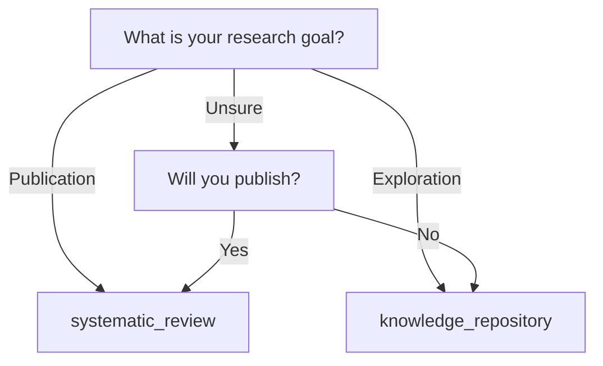

# Codex가 SKILL.md를 읽지 못하는 문제 해결 방안

**작성일**: 2025-10-24
**문제**: Codex는 AGENTS.md만 읽음 → SKILL.md의 중요한 정보(Stage 개요, decision tree 등) 접근 불가

---

## 🔴 문제 정의

### 현재 상황
```
Claude Code: SKILL.md 읽음 ✅ → Progressive disclosure, Stage-aware
Codex:       AGENTS.md만 읽음 ❌ → SKILL.md 정보 접근 불가
```

### 정보 격차 예시

| 정보 유형 | SKILL.md에만 존재 | Codex가 접근 못함 |
|----------|------------------|------------------|
| 7-Stage 개요 테이블 | ✅ | ❌ → 어떤 Stage가 뭔지 모름 |
| project_type decision tree | ✅ | ❌ → 사용자에게 설명 못함 |
| Critical branching points | ✅ | ❌ → 50% vs 90% 차이 모름 |
| Error recovery links | ✅ | ❌ → 에러 시 참조 문서 모름 |

### 구체적 시나리오

**사용자**: "Codex야, project_type을 어떻게 선택해?"

**Codex (현재 AGENTS.md만 읽음)**:
```bash
# 단순히 명령어만 제시
read -p "Choose 1) knowledge_repository or 2) systematic_review: " CHOICE
```
→ ❌ **왜 선택해야 하는지, 차이가 뭔지 설명 못함**

**Claude (SKILL.md 읽음)**:
```
Let me explain the difference:

**knowledge_repository**:
- 50% threshold (lenient)
- 15,000-20,000 papers
- For: Teaching, AI assistant, domain exploration

**systematic_review**:
- 90% threshold (strict)
- 50-300 papers
- For: Meta-analysis, publication

See decision tree: [skills/reference/project_type_decision_tree.md]
```
→ ✅ **맥락 설명, decision tree 제공**

---

## 💡 해결 방안 (3가지 전략)

## 전략 1: AGENTS.md에 핵심 정보 임베딩 (Recommended)

### 접근법: "Self-Contained AGENTS.md"

**원칙**: SKILL.md의 **핵심 정보만** AGENTS.md에 중복 저장
- 전체 복사 ❌
- Task별 필요한 context만 임베딩 ✅

### 구현 예시

#### AGENTS.md (Before - 정보 부족)
```markdown
## Task 1: Initialize New Project

**Execution**:
```bash
read -p "Project name: " PROJECT_NAME
python scholarag_cli.py init --name "$PROJECT_NAME"
```
```

#### AGENTS.md (After - Context 임베딩)
```markdown
## Task 1: Initialize New Project

**Context**: ScholaRAG supports 2 project types (choose based on research goal)

| Type | Threshold | Output | Best For |
|------|-----------|--------|----------|
| knowledge_repository | 50% (lenient) | 15K-20K papers | Teaching, exploration |
| systematic_review | 90% (strict) | 50-300 papers | Meta-analysis, publication |

**Decision tree**: See inline guide below ↓

**Interactive Decision Helper**:
```bash
echo "What is your research goal?"
echo "  1) Publication-quality systematic review"
echo "  2) Comprehensive domain knowledge"
read -p "Choose (1 or 2): " GOAL

if [ "$GOAL" = "1" ]; then
  PROJECT_TYPE="systematic_review"
  echo "→ systematic_review mode (90% threshold, PRISMA 2020 compliant)"
elif [ "$GOAL" = "2" ]; then
  PROJECT_TYPE="knowledge_repository"
  echo "→ knowledge_repository mode (50% threshold, comprehensive coverage)"
else
  echo "Invalid choice. Defaulting to systematic_review (stricter is safer)"
  PROJECT_TYPE="systematic_review"
fi
```

**Execution**:
```bash
read -p "Project name: " PROJECT_NAME
read -p "Research question: " QUESTION

python scholarag_cli.py init \
  --name "$PROJECT_NAME" \
  --question "$QUESTION" \
  --project-type "$PROJECT_TYPE"
```

**For detailed decision tree**:
- Claude users: See SKILL.md → skills/reference/project_type_decision_tree.md
- Codex users: Use inline helper above (simplified 2-question version)
```

### 임베딩할 핵심 정보 목록

| SKILL.md 정보 | AGENTS.md 임베딩 방법 | 상세 정보 위치 |
|--------------|---------------------|---------------|
| 7-Stage 개요 | Task별 1줄 요약 + 다음 Task 링크 | SKILL.md (Claude 전용) |
| project_type 차이 | 2×4 테이블 (간결 버전) | skills/reference/*.md |
| Critical branching | Task 시작 시 "⚠️ Critical" 표시 | SKILL.md |
| Error recovery | Task별 "Common Errors" 섹션 | skills/error_recovery.md |
| API endpoints | Task에서 사용하는 endpoint만 | skills/reference/api_reference.md |

### 중복 최소화 규칙

**Full copy ❌**:
```markdown
# AGENTS.md (Bad - 전체 복사)
## API Reference
[... 500 lines of API docs copied from SKILL.md ...]
```

**Context-aware embedding ✅**:
```markdown
# AGENTS.md (Good - Task별 필요한 것만)
## Task 2: Fetch Papers

**API Used**: Semantic Scholar (https://api.semanticscholar.org/graph/v1/paper/search)
**Key Parameters**:
- query: Search string
- fields: title,abstract,authors,year,openAccessPdf
- limit: 100 (max per request)

**For full API spec**: See skills/reference/api_reference.md (Claude users)
```

---

## 전략 2: AGENTS.md에서 SKILL.md 참조 + Fallback 제공

### 접근법: "Smart Cross-Reference"

**원칙**: SKILL.md 링크 제공 + 링크 실패 시 인라인 fallback

### 구현 예시

```markdown
## Task 3: Configure PRISMA Criteria

**Background**: Understanding project_type is critical for this task.

**For detailed explanation**:
- **Claude users**: Read [SKILL.md: Critical Branching Points](SKILL.md#critical-branching-points)
- **Codex users**: If you can't access SKILL.md, use this quick guide ↓

---

### Quick Guide: project_type Selection (Codex Fallback)

**If your goal is**:
- Meta-analysis for publication → `systematic_review` (90% threshold)
- PhD dissertation systematic review → `systematic_review`
- Clinical guidelines → `systematic_review`
- Teaching materials → `knowledge_repository` (50% threshold)
- AI research assistant → `knowledge_repository`
- Domain exploration → `knowledge_repository`

**If unsure**:
- Expected papers < 500 → `systematic_review`
- Expected papers > 5,000 → `knowledge_repository`

**Default recommendation**: Start with `systematic_review` (stricter is safer, can relax later)

---

**Execution**:
```bash
read -p "Enter project_type (systematic_review or knowledge_repository): " PROJECT_TYPE
# Validate input
if [[ ! "$PROJECT_TYPE" =~ ^(systematic_review|knowledge_repository)$ ]]; then
  echo "Invalid type. Defaulting to systematic_review"
  PROJECT_TYPE="systematic_review"
fi

# Update config.yaml
sed -i '' "s/project_type: .*/project_type: $PROJECT_TYPE/" config.yaml
```
```

### 장점
- ✅ Codex도 필수 정보 접근 가능 (fallback 활용)
- ✅ Claude는 더 상세한 SKILL.md 버전 읽음 (progressive disclosure)
- ✅ 정보 중복 최소화 (fallback은 간결 버전)

### 단점
- ⚠️ AGENTS.md 길이 증가 (하지만 통제 가능)

---

## 전략 3: skills/ 폴더를 Codex도 읽을 수 있게 만들기

### 접근법: "Universal Reference Library"

**원칙**: skills/reference/*.md는 Claude/Codex 공용으로 설계

### 폴더 구조

```
ScholaRAG/
├── SKILL.md (400 lines) ← Claude만 읽음 (progressive disclosure 인덱스)
├── AGENTS.md (500 lines) ← Codex만 읽음 (task-based workflows)
│
└── skills/
    ├── reference/ ← Claude + Codex 공용
    │   ├── project_type_decision_tree.md ← Universal (양쪽 모두 참조)
    │   ├── api_reference.md ← Universal
    │   ├── config_schema.md ← Universal
    │   └── troubleshooting.md ← Universal
    │
    ├── claude_only/ ← Claude 전용
    │   ├── stage1_research_setup.md (대화 흐름 중심)
    │   ├── stage2_query_strategy.md
    │   └── ... (7 files)
    │
    └── codex_only/ ← Codex 전용 (필요 시)
        └── bash_utilities.md (고급 bash 패턴)
```

### skills/reference/ 파일 작성 가이드

**Universal 파일은 에이전트 중립적으로 작성**:

```markdown
# project_type Decision Tree

> **Note**: This file is referenced by both Claude (SKILL.md) and Codex (AGENTS.md).
> Keep content agent-agnostic (no "Claude will..." or "Codex should..." references).

## Decision Flowchart



## Comparison Table

| Criteria | knowledge_repository | systematic_review |
|----------|---------------------|-------------------|
| Threshold | 50% | 90% |
| Output | 15K-20K papers | 50-300 papers |
| PRISMA | Adapted | Full PRISMA 2020 |

[... rest of content ...]
```

### AGENTS.md에서 참조

```markdown
## Task 1: Initialize New Project

**Step 1: Choose project_type**

For decision tree, read: [skills/reference/project_type_decision_tree.md](skills/reference/project_type_decision_tree.md)

**Quick CLI helper** (if you can't open markdown files):
```bash
# Interactive decision script
cat << 'EOF' > /tmp/choose_project_type.sh
#!/bin/bash
echo "Will you publish this as a systematic review? (yes/no)"
read PUBLISH
if [ "$PUBLISH" = "yes" ]; then
  echo "systematic_review"
else
  echo "knowledge_repository"
fi
EOF

PROJECT_TYPE=$(bash /tmp/choose_project_type.sh)
echo "Selected: $PROJECT_TYPE"
```
```

### 장점
- ✅ 정보 중복 제로 (skills/reference/는 SSOT)
- ✅ Codex도 상세 정보 접근 가능
- ✅ 유지보수 용이 (한 곳만 업데이트)

### 단점
- ⚠️ Codex가 markdown 파일을 읽을 수 있어야 함 (대부분 가능)
- ⚠️ 폴더 구조 복잡도 증가

---

## 🎯 권장 전략: 하이브리드 접근

### 조합: 전략 1 + 전략 3

**구현 방법**:

1. **skills/reference/ → Universal** (Claude + Codex 공용)
   - project_type_decision_tree.md
   - api_reference.md
   - config_schema.md
   - troubleshooting.md

2. **AGENTS.md → Context Embedding** (필수 정보만)
   - Task별 시작 시 "Quick Context" 섹션 추가
   - skills/reference/ 링크 + 간결 fallback 제공

3. **SKILL.md → Progressive Disclosure** (Claude 전용)
   - Stage별 상세 파일 (skills/stage*.md)
   - 대화 흐름, validation rules 등

### 실제 구현 예시

#### AGENTS.md (Task 1)
```markdown
## Task 1: Initialize New Project

### Quick Context (Essential Background)

**ScholaRAG supports 2 modes**:
- `knowledge_repository`: Comprehensive (50% threshold, 15K+ papers)
- `systematic_review`: Publication-quality (90% threshold, 50-300 papers)

**Decision helper**:
- Publishing systematic review? → `systematic_review`
- Teaching/exploration? → `knowledge_repository`
- **Full decision tree**: [skills/reference/project_type_decision_tree.md](skills/reference/project_type_decision_tree.md)

---

### Execution

```bash
# Step 1: Choose project type
echo "Choose project type:"
echo "  1) systematic_review (strict, publication-quality)"
echo "  2) knowledge_repository (comprehensive, exploration)"
read -p "Enter 1 or 2: " CHOICE

case $CHOICE in
  1) PROJECT_TYPE="systematic_review" ;;
  2) PROJECT_TYPE="knowledge_repository" ;;
  *)
    echo "Invalid. Defaulting to systematic_review (safer)"
    PROJECT_TYPE="systematic_review"
    ;;
esac

# Step 2: Get project details
read -p "Project name: " PROJECT_NAME
read -p "Research question: " QUESTION

# Step 3: Initialize
python scholarag_cli.py init \
  --name "$PROJECT_NAME" \
  --question "$QUESTION" \
  --project-type "$PROJECT_TYPE"

# Step 4: Validate
ls projects/*/config.yaml || { echo "ERROR: Init failed"; exit 1; }

echo "✅ Project initialized with $PROJECT_TYPE mode"
echo "➡️ Next: Task 2 (Design Query)"
```

**For conceptual background**: See [SKILL.md](SKILL.md) (Claude users)
```

#### skills/reference/project_type_decision_tree.md (Universal)
```markdown
# Project Type Selection: Decision Tree

> **Universal Reference**: Used by both Claude (SKILL.md) and Codex (AGENTS.md)

## Quick Decision (2 Questions)

### Question 1: Will you publish this as a systematic review?
- **Yes** → `systematic_review` ✅
- **No** → Go to Question 2

### Question 2: Do you need comprehensive domain coverage?
- **Yes (15K+ papers)** → `knowledge_repository` ✅
- **No (focused subset)** → `systematic_review` ✅

---

## Detailed Comparison

| Aspect | knowledge_repository | systematic_review |
|--------|---------------------|-------------------|
| **Screening Threshold** | 50% AI confidence | 90% AI confidence |
| **Typical Input** | 20K-30K papers | 1K-5K papers |
| **Typical Output** | 15K-20K papers (80-90% retained) | 50-300 papers (2-10% retained) |
| **PRISMA Compliance** | Adapted workflow | Full PRISMA 2020 |
| **Use Cases** | - Teaching materials<br/>- AI research assistant<br/>- Domain exploration<br/>- Literature discovery | - Meta-analysis<br/>- Dissertation/thesis<br/>- Clinical guidelines<br/>- Journal publication |
| **Time Investment** | ~2-3 hours (mostly automated) | ~3-5 hours (includes quality checks) |
| **Human Review** | Optional (trust AI) | Recommended (validate borderline cases 85-95%) |

---

## Decision Examples

### Example 1: PhD Dissertation (Systematic Review Chapter)
**Goal**: Publication-quality systematic review for Chapter 2
**Choose**: `systematic_review` ✅
**Reason**: Need PRISMA 2020 compliance for journal submission

### Example 2: Professor Building Teaching Materials
**Goal**: Comprehensive AI teaching assistant for undergrad course
**Choose**: `knowledge_repository` ✅
**Reason**: Need broad coverage (10K+ papers) for diverse student questions

### Example 3: Meta-Analysis Preparation (Uncertain)
**Goal**: Exploring correlation extraction, unsure about final paper count
**Recommendation**: Start with `systematic_review` ✅
**Reason**: Run Stages 1-3, assess paper count, expand if needed (<50 papers)

---

## How to Change project_type Later

**If you realize you chose wrong mode**:

```bash
# 1. Edit config.yaml
vim config.yaml
# Change line: project_type: systematic_review

# 2. Re-run screening (Stage 3)
python scripts/03_screen_papers.py --project .

# 3. Screening threshold automatically adjusts
# - systematic_review: 90%
# - knowledge_repository: 50%
```

**Impact**:
- ✅ Threshold updates immediately
- ✅ Already downloaded PDFs remain (no data loss)
- ⚠️ May need to re-run Stage 4-5 if paper count changes significantly

---

## Integration Notes

**For Claude users**:
- This file is referenced in [SKILL.md: Critical Branching Points](../SKILL.md#critical-branching-points)
- Read [stage1_research_setup.md](../claude_only/stage1_research_setup.md) for conversation flow

**For Codex users**:
- This file is referenced in [AGENTS.md: Task 1](../AGENTS.md#task-1-initialize-new-project)
- Use inline decision helper in Task 1 for quick selection
```

---

## 📊 전략 비교표

| 전략 | 정보 중복 | Codex 접근성 | 유지보수 | 추천도 |
|------|----------|-------------|---------|-------|
| 1. Context Embedding | 중간 (20-30%) | ✅✅✅ 높음 | 중간 | ⭐⭐⭐⭐ |
| 2. Cross-Reference + Fallback | 낮음 (10-15%) | ✅✅ 보통 | 쉬움 | ⭐⭐⭐ |
| 3. Universal Reference | 없음 (0%) | ✅✅✅ 높음 | 매우 쉬움 | ⭐⭐⭐⭐⭐ |
| **하이브리드 (1+3)** | **낮음 (10%)** | **✅✅✅ 높음** | **쉬움** | **⭐⭐⭐⭐⭐** |

---

## 🚀 실행 계획

### Week 1: 하이브리드 구현

**1. skills/reference/ 폴더 생성 및 파일 작성**
```bash
cd "/Volumes/External SSD/Projects/Research/ScholaRAG"

mkdir -p skills/reference skills/claude_only

# Universal 파일 작성 (Claude + Codex 공용)
vim skills/reference/project_type_decision_tree.md
vim skills/reference/api_reference.md
vim skills/reference/config_schema.md
vim skills/reference/troubleshooting.md
```

**2. AGENTS.md에 Context Embedding 추가**
```bash
# Task별로 "Quick Context" 섹션 추가
vim AGENTS.md

# 추가할 섹션 (각 Task 시작 부분):
# - Quick Context (필수 배경지식)
# - Execution (bash 명령어)
# - For detailed background (skills/reference/ 링크)
```

**3. SKILL.md에서 skills/reference/ 참조**
```bash
vim SKILL.md

# Critical Branching Points 섹션에:
# - [Decision tree](skills/reference/project_type_decision_tree.md) 링크 추가
# - [API reference](skills/reference/api_reference.md) 링크 추가
```

### Week 2: 테스트 및 검증

**Codex 테스트**:
```bash
# Codex로 Task 1 실행해보기
# → skills/reference/project_type_decision_tree.md 읽을 수 있는지 확인
# → Quick Context만으로도 작업 가능한지 확인
```

**Claude 테스트**:
```bash
# Claude로 Stage 1 실행해보기
# → SKILL.md → skills/reference/ 링크 따라가는지 확인
# → Progressive disclosure 동작하는지 확인
```

---

## ✅ 체크리스트

### skills/reference/ Universal 파일 작성 기준
- [ ] 에이전트 중립적 (Claude/Codex 모두 이해 가능)
- [ ] Markdown 기본 문법만 사용 (복잡한 확장 기능 회피)
- [ ] 예시 코드는 bash와 설명 모두 포함
- [ ] 상단에 "Universal Reference" 표시
- [ ] SSOT (다른 곳에 중복 없음)

### AGENTS.md Context Embedding 기준
- [ ] Task당 "Quick Context" 100-150 words 이하
- [ ] 핵심만 간결하게 (테이블, 2-3 bullet points)
- [ ] skills/reference/ 링크 항상 제공
- [ ] Fallback은 2-question decision helper 수준
- [ ] 전체 AGENTS.md 길이 700 lines 이하 유지

### SKILL.md Progressive Disclosure 기준
- [ ] 메인 파일 400 lines 이하
- [ ] skills/claude_only/*.md는 300-500 lines
- [ ] skills/reference/ 참조 시 명시적 링크
- [ ] Codex 사용자를 위한 AGENTS.md 참조 제공

---

## 🎯 결론

**최종 권장 전략**: **하이브리드 (Context Embedding + Universal Reference)**

**핵심 원칙**:
1. **Universal Reference Library** (skills/reference/)
   - Claude/Codex 공용
   - 상세 정보는 여기에만 (SSOT)

2. **Context Embedding** (AGENTS.md)
   - Task별 필수 배경지식만 간결하게
   - skills/reference/ 링크 항상 제공

3. **Progressive Disclosure** (SKILL.md → skills/claude_only/)
   - Claude 전용 대화 흐름
   - Stage별 상세 가이드

**기대 효과**:
- ✅ Codex도 필수 정보 접근 가능
- ✅ 정보 중복 최소 (~10%)
- ✅ 유지보수 용이 (skills/reference/만 업데이트)
- ✅ Claude의 progressive disclosure 장점 유지

---

**문서 버전**: 1.0
**작성일**: 2025-10-24
**작성자**: Claude (Anthropic) + HosungYou
**관련 문서**:
- [Multi-Agent_Strategy_SKILL_vs_AGENTS.md](Multi-Agent_Strategy_SKILL_vs_AGENTS.md)
- [ScholaRAG_Refactoring_Plan.md](ScholaRAG_Refactoring_Plan.md)
