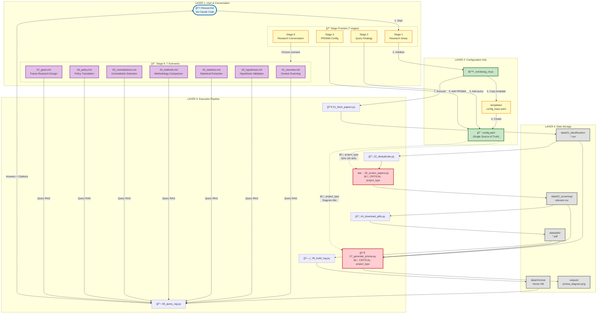
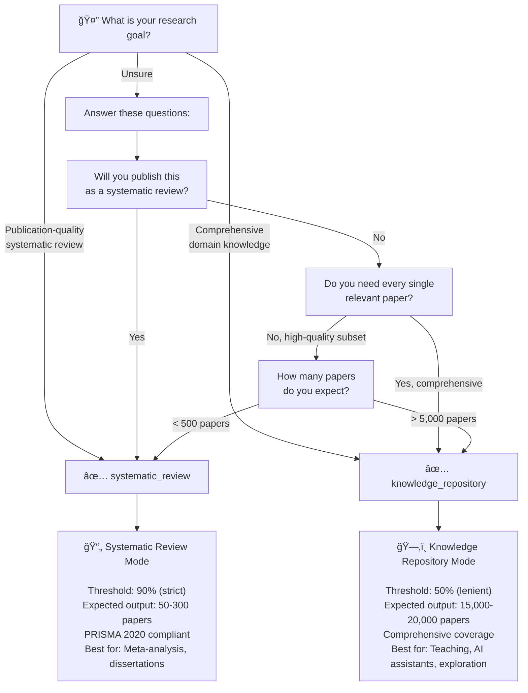

# ScholaRAG ë¦¬íŒ©í† ë§ ê³„íš: Agent Skills 통합 ë° êµ¬ì¡° 최ì í™”

**ì‘성ì¼**: 2025-10-23
**목ì **: Agent Skills 프레ì„워í¬ë¥¼ 활용한 í† í° ê´€ë¦¬ 최ì í™”, 코드-문서 ë™ê¸°í™”, 연구ì UX 개선

---

## 📊 현황 ë¶„ì„ (Current State Analysis)

### 1. íŒŒì¼ êµ¬ì¡° 현황

#### ë©”ì¸ ì €ì¥ì†Œ (ScholaRAG)
```
ScholaRAG/
├── CLAUDE.md (100 lines) - 시스템 레벨 ë™ì‘ ê°€ì´ë“œ
├── SKILL.md (40 lines) - Codex ì „ìš© 스킬 (í˜„ì¬ ë¯¸í™œìš©)
├── scholarag_cli.py (1,211 lines) - 프로ì íŠ¸ 관리 CLI
├── scripts/ (11ê°œ Python 파ì¼)
│   ├── 01_fetch_papers.py
│   ├── 02_deduplicate.py
│   ├── 03_screen_papers.py (âš ï¸ project_type 분기ì )
│   ├── 04_download_pdfs.py
│   ├── 05_build_rag.py
│   ├── 06_query_rag.py
│   ├── 07_generate_prisma.py (âš ï¸ project_type 분기ì )
│   └── core/, validate_*, generate_*, evaluate_*
└── prompts/ (9ê°œ Markdown 파ì¼)
    ├── 01_research_domain_setup.md
    ├── 02_query_strategy.md
    ├── 03_prisma_configuration.md
    ├── 04_rag_design.md
    ├── 05_execution_plan.md
    ├── 06_research_conversation.md (+ 7개 하위 시나리오)
    └── 07_documentation_writing.md
```

#### 문서 웹사ì´íŠ¸ (ScholaRAG-helper)
```
frontend/
├── app/
│   ├── page.tsx (홈í˜ì´ì§€)
│   ├── guide/ (7ê°œ ê°€ì´ë“œ í˜ì´ì§€)
│   │   ├── 01-introduction/
│   │   ├── 02-getting-started/
│   │   ├── 03-core-concepts/
│   │   ├── 04-implementation/
│   │   ├── 05-advanced-topics/
│   │   ├── 06-research-conversation/
│   │   ├── 07-documentation-writing/
│   │   └── prompt-library/ (7개 시나리오 템플릿)
│   └── codebook/
│       ├── architecture/ (✅ 제공한 다ì´ì–´ê·¸ë¨ 위치)
│       ├── fundamentals/
│       ├── scripts-workflow/
│       └── tools/
```

---

## 🔴 ë°œê²¬ëœ ë¬¸ì œì  (Issues Identified)

### A. êµ¬ì¡°ì  ë¬¸ì œ (Structural Issues)

#### A1. Agent Skills 미활용 âš ï¸
**문제**:
- í˜„ì¬ `SKILL.md`는 Codex ì „ìš© ê°€ì´ë“œ (40 lines)
- Claude Agent Skills 프레ì„워í¬ë¥¼ 전혀 활용하지 ì•ŠìŒ
- CLAUDE.mdê°€ 100ë¼ì¸ìœ¼ë¡œ 제한ë˜ì–´ ìˆìœ¼ë‚˜, 실제 필요한 컨í…스트는 훨씬 방대함

**ì˜í–¥**:
- Claude Codeê°€ 매 대화마다 ì „ì²´ CLAUDE.md를 로드 → í† í° ë‚­ë¹„
- 단계별(Stage 1-7) 특화 컨í…스트 제공 불가
- Progressive disclosure 미활용 → 불필요한 정보까지 ë©”ëª¨ë¦¬ì— ìƒì£¼

#### A2. íŒŒì¼ ì˜ì¡´ì„± 다ì´ì–´ê·¸ë¨ê³¼ 실제 코드 불ì¼ì¹˜
**문제**:
- 다ì´ì–´ê·¸ë¨: 4 layers (User, Configuration, Execution, Data)
- 실제 코드: 혼ì¬ëœ ì±…ì„ (CLIê°€ orchestration + initialization ë™ì‹œ 수행)
- `scholarag_cli.py` 1,211 ë¼ì¸ì— init, status, list, stage-status, run-stage, next, stage6-examples, upgrade ëª¨ë‘ í¬í•¨

**êµ¬ì²´ì  ë¶ˆì¼ì¹˜**:
1. **다ì´ì–´ê·¸ë¨**: `config_base.yaml` → `config.yaml` (단순 템플릿 복사)
   **실제 코드**: `scholarag_cli.py`ê°€ 템플릿 로드 + ë™ì  í•„ë“œ ìƒì„± + validation 수행

2. **다ì´ì–´ê·¸ë¨**: Stage 1-7ì´ ìˆœì°¨ì  íŒŒì´í”„ë¼ì¸
   **실제 코드**: Stage 6ì€ 7ê°œ 시나리오로 분기 (06_research_conversation/*.md)

3. **다ì´ì–´ê·¸ë¨**: `prompts/*.md`ê°€ 단순 ê°€ì´ë“œ ì—­í• 
   **실제 코드**: HTML 메타ë°ì´í„° ë¸”ë¡ í¬í•¨, Claudeê°€ ì½ì–´ì•¼ í•  êµ¬ì¡°í™”ëœ ë°ì´í„°

#### A3. 7-Stage vs 5-Stage 문서 불ì¼ì¹˜ âš ï¸
**홈í˜ì´ì§€ (page.tsx:162)**:
```tsx
"Follow the 7-stage workflow in VS Code"
```

**README.md (실제 설명)**:
- Stage 1-4: PRISMA 2020 (Identification, Screening, Assessment, RAG Build)
- Stage 5-6: RAG Usage (Research Conversation, Documentation)
- **실제 prompts/ í´ë”**: 7ê°œ íŒŒì¼ (01~07)

**CLAUDE.md Line 51**:
```markdown
You are stage-aware - Track which stage (1-7) researcher is currently in
```

**í˜¼ë€ ì§€ì **:
- ì¼ë¶€ 문서는 "5-stage"ë¼ê³  표기 (README Line 161, 508)
- CLI 코드는 7 stages 가정 (scholarag_cli.py Line 662, 823)
- 홈í˜ì´ì§€ëŠ” 7 stages 표기

**ê²°ë¡ **: 7 stagesê°€ 정답ì´ë‚˜, ì¼ë¶€ êµ¬ë¬¸ì„œì— 5-stage ì”ì—¬ 표현 ì¡´ì¬

---

### B. 코드-문서 ë™ê¸°í™” 문제 (Code-Documentation Gaps)

#### B1. project_type 분기 ë¡œì§ ë¶ˆíˆ¬ëª…
**코드ì—ì„œ** ([03_screen_papers.py:62-79](ScholaRAG/scripts/03_screen_papers.py#L62-L79)):
```python
if project_type == 'knowledge_repository':
    self.screening_threshold = 50  # Lenient
else:
    self.screening_threshold = 90  # Strict (systematic_review)
```

**문서ì—ì„œ** ([architecture/page.tsx:205-210](ScholaRAG-helper/frontend/app/codebook/architecture/page.tsx#L205-L210)):
```tsx
<strong>Critical:</strong> Sets screening thresholds
(50% for knowledge_repository, 90% for systematic_review)
```

**문제**:
1. ✅ 문서는 ì •í™•íˆ ë°˜ì˜ë¨
2. ⌠**연구ìê°€ ì´ ì •ë³´ë¥¼ 언제 필요로 하는지 명확하지 ì•ŠìŒ**
   - Stage 1 (project_type ì„ íƒ ì‹œ)ì— ì´ ì°¨ì´ë¥¼ 설명해야 하는가?
   - Stage 3 (PRISMA config ì‹œ)ì— threshold ì˜ë¯¸ë¥¼ 설명해야 하는가?
3. ⌠`prompts/01_research_domain_setup.md`ì— project_type ì„ íƒ ê¸°ì¤€ì´ **명시ì ìœ¼ë¡œ 제시ë˜ì§€ ì•ŠìŒ**

**개선 방안**:
- Stage 1 promptì— decision tree 추가:
  ```markdown
  ## Choosing Project Type

  | If you need...              | Choose                  | Threshold | Typical Result      |
  |-----------------------------|-------------------------|-----------|---------------------|
  | Comprehensive domain map    | knowledge_repository    | 50%       | 15,000-20,000 papers|
  | Publication-ready review    | systematic_review       | 90%       | 50-300 papers       |
  ```

#### B2. Stage 6 시나리오 분기 미문서화
**코드** ([scholarag_cli.py:903-967](ScholaRAG/scholarag_cli.py#L903-L967)):
- `stage6-examples` 명령어: 7ê°œ 시나리오 ëª©ë¡ ì¶œë ¥
- `stage6-prompt <scenario>` 명령어: 특정 시나리오 프롬프트 복사

**문서** ([guide/06-research-conversation](ScholaRAG-helper/frontend/app/guide/06-research-conversation/)):
- ✅ 7ê°œ 시나리오 개별 í˜ì´ì§€ ì¡´ì¬
- ⌠**아키í…처 다ì´ì–´ê·¸ë¨ì— Stage 6 분기 표시 ì—†ìŒ**
- ⌠`prompts/06_research_conversation.md` ë©”ì¸ íŒŒì¼ê³¼ 하위 í´ë” 관계 설명 부족

**다ì´ì–´ê·¸ë¨ 개선 í•„ìš”**:
```mermaid
Stage 6: Research Conversation
    ├─ 01_overview.md (Context Scanning)
    ├─ 02_hypothesis.md (Hypothesis Validation)
    ├─ 03_statistics.md (Statistical Extraction)
    ├─ 04_methods.md (Methodology Comparison)
    ├─ 05_contradictions.md (Contradiction Detection)
    ├─ 06_policy.md (Policy Translation)
    └─ 07_grant.md (Future Research Design)
```

#### B3. 메타ë°ì´í„° ë¸”ë¡ ì‚¬ìš©ë²• 미문서화 âš ï¸
**CLAUDE.md**ê°€ 설명하는 메타ë°ì´í„° 구조 ([CLAUDE.md:78-100](ScholaRAG/CLAUDE.md#L78-L100)):
```html
<!-- METADATA
stage: 1
stage_name: "Research Domain Setup"
expected_duration: "15-20 minutes"
outputs:
  - research_question: "..."
validation_rules:
  research_question:
    required: true
-->
```

**실제 prompts/ 파ì¼ë“¤**:
- ⌠**메타ë°ì´í„° 블ë¡ì´ 실제로 ì¡´ì¬í•˜ì§€ ì•ŠìŒ**
- í˜„ì¬ prompts는 순수 Markdown í…스트
- Claude Codeê°€ ì½ì„ êµ¬ì¡°í™”ëœ ë°ì´í„°ê°€ ì—†ìŒ

**ì´ê²ƒì€ critical gap**:
1. CLAUDE.md는 "메타ë°ì´í„°ë¥¼ ì½ê³  stage-aware ë™ì‘"ì„ ì§€ì‹œ
2. 실제 prompts는 메타ë°ì´í„°ê°€ 없어 ì´ ê¸°ëŠ¥ 불가능
3. `.claude/context.json` ì¡´ì¬í•˜ì§€ë§Œ prompts와 ì—°ë™ ì•ˆ ë¨

---

### C. 연구ì UX 문제 (Researcher Experience Issues)

#### C1. 대화 í름 예측 불가능
**연구ì ê´€ì **:
1. 웹사ì´íŠ¸ì—ì„œ Stage 1 프롬프트 복사
2. Claude Codeì— ë¶™ì—¬ë„£ê¸°
3. **â“ ì´ì œ ë¬´ì—‡ì´ ì¼ì–´ë‚˜ëŠ”ê°€?**
   - Claudeê°€ ì§ˆë¬¸ì„ ëª‡ 번ì´ë‚˜ 할까?
   - ì–´ë–¤ 파ì¼ë“¤ì´ ìë™ ìƒì„±ë ê¹Œ?
   - ë‹¤ìŒ ë‹¨ê³„ë¡œ 넘어가는 트리거는?

**í˜„ì¬ ë¬¸ì„œê°€ 제공하지 않는 ì •ë³´**:
- ê° Stage별 ì˜ˆìƒ ëŒ€í™” í„´ 수
- Claudeê°€ ìë™ ì‹¤í–‰í•  명령어 목ë¡
- Stage 완료 조건 (validation checklist)
- ì˜ˆìƒ ì†Œìš” 시간

#### C2. ì—러 복구 시나리오 부ì¬
**만약 연구ìê°€**:
- Stage 2ì—ì„œ queryê°€ 너무 ë„“ì–´ì„œ 30,000ê°œ ë…¼ë¬¸ì´ ë‚˜ì˜¨ë‹¤ë©´?
- Stage 3 screeningì´ ì‹¤íŒ¨í•œë‹¤ë©´?
- API keyê°€ 만료ë˜ì—ˆë‹¤ë©´?
- PDF 다운로드가 50% 실패한다면?

**í˜„ì¬ ë¬¸ì„œ**:
- ⌠ì—러 í•¸ë“¤ë§ ê°€ì´ë“œ ì—†ìŒ
- ⌠Rollback/retry 방법 ì—†ìŒ
- ⌠Stage ì¬ì‹¤í–‰ 방법 불명확

#### C3. 진행 ìƒí™© ì¶”ì  ì–´ë ¤ì›€
**`.scholarag/context.json` ì¡´ì¬í•˜ì§€ë§Œ**:
- 웹 ëŒ€ì‹œë³´ë“œì— ì—°ë™ë˜ì§€ ì•ŠìŒ (URL param만 사용: `?project=2025-10-13_AI-Chatbots`)
- `scholarag status` 명령어는 íŒŒì¼ ì¡´ì¬ ì—¬ë¶€ë§Œ ì²´í¬
- 실제 대화 íˆìŠ¤í† ë¦¬, ê²°ì • 사항, 실패 ì´ìœ  ë“±ì€ ì¶”ì  ì•ˆ ë¨

---

## ğŸ¯ ë¦¬íŒ©í† ë§ ëª©í‘œ (Refactoring Goals)

### 목표 1: Agent Skills 프레ì„ì›Œí¬ ì™„ì „ 통합
- [ ] Progressive disclosure 구조로 CLAUDE.md ì¬êµ¬ì„±
- [ ] Stage별 SKILL.md íŒŒì¼ ìƒì„± (7ê°œ)
- [ ] 500-line 제한 준수
- [ ] 실행 가능한 스í¬ë¦½íŠ¸ 분리

### 목표 2: 코드-문서 100% ë™ê¸°í™”
- [ ] 아키í…처 다ì´ì–´ê·¸ë¨ì— Stage 6 분기 추가
- [ ] project_type decision tree 추가
- [ ] prompts/*.mdì— ë©”íƒ€ë°ì´í„° ë¸”ë¡ ì‹¤ì œ 구현
- [ ] 7-stage ì¼ê´€ì„± 확보 (5-stage 표현 제거)

### 목표 3: 연구ì UX 개선
- [ ] ê° Stage별 "What to Expect" 섹션 추가
- [ ] ì—러 복구 ê°€ì´ë“œ ì‘성
- [ ] 대화 í름 예시 (example conversations) 제공
- [ ] 진행 ìƒí™© ì‹œê°í™” 개선

---

## 📋 êµ¬ì²´ì  ë¦¬íŒ©í† ë§ ê³„íš (Detailed Refactoring Plan)

## Phase 1: Agent Skills 구조 구축 (1-2 weeks)

### 1.1 SKILL.md 계층 구조 설계

**목표**: Claude Agent Skills 프레ì„워í¬ì˜ progressive disclosure ì›ì¹™ ì ìš©

#### ì‹ ê·œ íŒŒì¼ êµ¬ì¡°
```
ScholaRAG/
├── SKILL.md (ë©”ì¸ ìŠ¤í‚¬, ~400 lines)
│   ├── 메타ë°ì´í„° (name, description)
│   ├── Quick Start (30분 ì…‹ì—… ê°€ì´ë“œ)
│   ├── 7-Stage 개요
│   └── ìƒì„¸ ì •ë³´ ë§í¬
├── skills/
│   ├── stage1_research_setup.md (~300 lines)
│   ├── stage2_query_strategy.md (~300 lines)
│   ├── stage3_prisma_config.md (~400 lines)
│   ├── stage4_rag_design.md (~300 lines)
│   ├── stage5_execution.md (~250 lines)
│   ├── stage6_research_conversation.md (~500 lines)
│   │   ├── scenarios/ (7ê°œ 시나리오별 파ì¼)
│   │   │   ├── overview.md
│   │   │   ├── hypothesis.md
│   │   │   ├── statistics.md
│   │   │   ├── methods.md
│   │   │   ├── contradictions.md
│   │   │   ├── policy.md
│   │   │   └── grant.md
│   ├── stage7_documentation.md (~200 lines)
│   ├── error_recovery.md (~400 lines)
│   └── reference/
│       ├── api_reference.md (Semantic Scholar, OpenAlex, arXiv)
│       ├── config_schema.md (config.yaml 전체 스키마)
│       ├── prisma_guidelines.md (PRISMA 2020 ìƒì„¸)
│       └── troubleshooting.md (FAQ + ì—러 코드)
└── scripts/
    └── utils/ (실행 가능한 유틸리티, SKILL.mdì—ì„œ 호출)
```

#### SKILL.md 구조 (ë©”ì¸ íŒŒì¼)
```markdown
---
name: scholarag
description: Build PRISMA 2020-compliant systematic literature review systems with RAG-powered analysis in VS Code. Use when researcher needs automated paper retrieval, AI-assisted screening, vector database creation, or research conversation interface. Supports both knowledge_repository (comprehensive) and systematic_review (publication-quality) modes.
---

# ScholaRAG: Systematic Review Automation Skill

## Quick Start (5 minutes)

**For researchers starting a new literature review:**

1. **Initialize project**: `python scholarag_cli.py init`
2. **Paste Stage 1 prompt**: Copy from https://www.scholarag.com/guide/01-introduction
3. **Follow conversation**: Answer Claude's questions about research domain
4. **Auto-proceed**: Claude executes scripts and moves you through 7 stages

**For AI assistants (Claude Code/Codex):**

When researcher provides a ScholaRAG prompt:
1. Check for HTML metadata block (<!-- METADATA ... -->)
2. Read current stage number and validation rules
3. Conduct conversation following expected_turns pattern
4. Execute scripts automatically when validation passes
5. Update .claude/context.json
6. Show next stage prompt

## 7-Stage Workflow Overview

| Stage | Name | Duration | Key Output | Auto-Execute |
|-------|------|----------|------------|--------------|
| 1 | Research Setup | 15-20 min | config.yaml, project_type | ✅ scholarag init |
| 2 | Query Strategy | 15-25 min | search_query in config.yaml | ⌠Manual review |
| 3 | PRISMA Config | 20-30 min | ai_prisma_rubric in config.yaml | ⌠Manual review |
| 4 | RAG Design | 10-15 min | rag_settings in config.yaml | ⌠Manual review |
| 5 | Execution | 2-4 hours | data/01_identification/ → data/chroma/ | ✅ Run all scripts |
| 6 | Research Conversation | Ongoing | Answers + citations | ⌠Interactive |
| 7 | Documentation | 30-60 min | outputs/prisma_diagram.png | ✅ Generate PRISMA |

**Progressive disclosure**: Click stage links below for detailed instructions.

## Stage-Specific Guidance

### [Stage 1: Research Domain Setup](skills/stage1_research_setup.md)
- Choose project_type (knowledge_repository vs systematic_review)
- Define research question and scope
- **Critical decision point**: Threshold selection (50% vs 90%)

### [Stage 2: Query Strategy](skills/stage2_query_strategy.md)
- Boolean query construction
- Database selection (Semantic Scholar, OpenAlex, arXiv)
- Expected paper counts by database

### [Stage 3: PRISMA Configuration](skills/stage3_prisma_config.md)
- Inclusion/exclusion criteria
- AI-assisted screening rubric
- **Critical branching**: project_type affects thresholds

[... continues for all 7 stages ...]

## Error Recovery

**Common issues and solutions**: See [Error Recovery Guide](skills/error_recovery.md)

**Quick fixes**:
- **Too many papers (>30,000)**: Refine query in Stage 2, re-run fetch
- **Low PDF success (<50%)**: Check open_access filters, consider manual download
- **API rate limit**: scripts auto-retry with backoff, check .env for keys

## Reference Materials

**For detailed specifications** (load only when needed):
- [API Reference](skills/reference/api_reference.md): Semantic Scholar, OpenAlex, arXiv endpoints
- [Config Schema](skills/reference/config_schema.md): Complete config.yaml documentation
- [PRISMA Guidelines](skills/reference/prisma_guidelines.md): PRISMA 2020 checklist
- [Troubleshooting](skills/reference/troubleshooting.md): Error codes and solutions

## Architecture Overview

**File dependencies**: See [codebook/architecture](https://www.scholarag.com/codebook/architecture)

**Key principle**: Scripts read from config.yaml (single source of truth), never hardcode values.

**Critical branching points**:
- `03_screen_papers.py`: Reads project_type → Sets threshold
- `07_generate_prisma.py`: Reads project_type → Changes diagram title

---

**Token optimization note**: This SKILL.md is ~400 lines. Stage-specific files (~300 lines each) load only when Claude needs detailed context for that stage. Reference materials (~400 lines each) load only when specific API/config questions arise.
```

### 1.2 메타ë°ì´í„° ë¸”ë¡ ì‹¤ì œ 구현

**í˜„ì¬ ë¬¸ì œ**: CLAUDE.md는 메타ë°ì´í„° 구조를 설명하지만, 실제 prompts/*.md 파ì¼ì—는 ì¡´ì¬í•˜ì§€ ì•ŠìŒ

**í•´ê²°ì±…**: 모든 prompts/*.md 파ì¼ì— 실제 메타ë°ì´í„° ë¸”ë¡ ì¶”ê°€

#### 예시: prompts/01_research_domain_setup.md
```markdown
<!-- METADATA
stage: 1
stage_name: "Research Domain Setup"
expected_duration: "15-20 minutes"
conversation_mode: "interactive"
expected_turns: 6-10
outputs:
  required:
    - project_name: "Descriptive name for project folder"
    - research_question: "Clear, answerable research question"
    - project_type: "knowledge_repository OR systematic_review"
    - year_range: "[start_year, end_year]"
  optional:
    - domain: "education, medicine, psychology, social-science, custom"
validation_rules:
  research_question:
    required: true
    min_length: 20
    validation: "Must be specific, answerable, and focused"
  project_type:
    required: true
    allowed_values: ["knowledge_repository", "systematic_review"]
    validation: "Must choose based on research goals (comprehensive vs publication-quality)"
  year_range:
    required: true
    validation: "start_year >= 2000, end_year <= 2025, range <= 25 years"
cli_commands:
  - command: "python scholarag_cli.py init --name '{project_name}' --question '{research_question}' --domain {domain}"
    auto_execute: true
    timing: "after_validation"
scripts_triggered:
  - none (initialization only, no data processing)
next_stage:
  stage: 2
  prompt_file: "prompts/02_query_strategy.md"
  transition_condition: "config.yaml created with valid project metadata"
divergence_handling:
  common_divergences:
    - pattern: "User asks about downloading PDFs"
      response: "PDF downloading happens in Stage 4 after screening. Right now in Stage 1, let's first define your research scope clearly. We'll design queries in Stage 2, then configure PRISMA criteria in Stage 3."
    - pattern: "User wants to skip systematic review"
      response: "If you don't need publication-quality systematic review, choose project_type: knowledge_repository in the next question. This mode uses lenient filtering (50% threshold) for comprehensive domain coverage."
    - pattern: "User confused about project_type difference"
      response: |
        Let me clarify the two modes:

        **knowledge_repository**:
        - Goal: Comprehensive domain map (15,000-20,000 papers)
        - Screening: 50% threshold (lenient, removes only spam)
        - Use case: Teaching materials, exploratory research, AI assistant

        **systematic_review**:
        - Goal: Publication-quality review (50-300 papers)
        - Screening: 90% threshold (strict, PRISMA 2020 compliant)
        - Use case: Meta-analysis, dissertations, clinical guidelines

        Which describes your research goal?
conversation_flow:
  typical_pattern:
    - turn: 1
      user_action: "Provides research topic"
      claude_action: "Ask clarifying questions about scope, constraints, expected paper count"
      example: "Is this for exploratory domain mapping or a publication-quality systematic review?"
    - turn: 2-3
      user_action: "Answers scope questions"
      claude_action: "Suggest project_type based on answers, explain threshold implications"
      example: "Based on your goal of meta-analysis, I recommend systematic_review mode with 90% screening threshold."
    - turn: 4-5
      user_action: "Confirms project_type choice"
      claude_action: "Suggest year range, publication types, expected databases"
      example: "For language learning studies, I recommend 2015-2025 (10 years) focusing on Semantic Scholar and ERIC."
    - turn: 6-8
      user_action: "Provides final details (domain, year range)"
      claude_action: "Summarize all decisions, ask for confirmation"
      example: "Here's what I'll create: [summary]. Ready to initialize?"
    - turn: 9-10
      user_action: "Confirms initialization"
      claude_action: "Execute scholarag_cli.py init, create config.yaml, show next steps"
      example: "✅ Project initialized! Next, let's design your search query in Stage 2."
completion_checklist:
  - check: "project_name is descriptive and unique"
    validation: "length >= 10 characters, no special characters"
  - check: "research_question is specific and answerable"
    validation: "length >= 20 characters, contains clear research variables"
  - check: "project_type chosen with understanding of implications"
    validation: "user explicitly acknowledges threshold difference (50% vs 90%)"
  - check: "year_range is realistic for scope"
    validation: "range <= 25 years, not earlier than 2000"
  - check: "config.yaml created successfully"
    validation: "file exists, contains all required fields, passes YAML parsing"
-->

# Stage 1: Research Domain Setup

**Goal**: Define your research question, choose project mode, and initialize project structure.

**Expected time**: 15-20 minutes (conversation only, no data processing)

**What happens in this stage**:
1. You describe your research topic to Claude
2. Claude asks clarifying questions about your goals
3. Together you choose between two modes:
   - **knowledge_repository** (comprehensive, 15K+ papers, 50% filtering)
   - **systematic_review** (publication-quality, 50-300 papers, 90% filtering)
4. Claude creates your project folder and `config.yaml`
5. You're ready for Stage 2 (Query Strategy)

---

## 🚀 Getting Started

Copy and paste this prompt to your AI assistant (Claude Code / GPT-5-Codex):

```
I want to build a RAG system for my research project using ScholaRAG.

**My Research Topic**: [Describe your topic here - e.g., "AI chatbots for language learning"]

**Research Field**: [e.g., Education, Medicine, Psychology]

**Current Status**:
- [ ] I've read some papers manually, but need systematic approach
- [ ] I'm starting from scratch, need to map the entire domain
- [ ] I have specific hypotheses to test

**My Goal**:
- [ ] Comprehensive domain knowledge (for teaching, AI assistant, exploration)
- [ ] Publication-quality systematic review (for meta-analysis, dissertation)
- [ ] Unsure, need help deciding

Please guide me through Stage 1 of ScholaRAG setup.
```

[... rest of the prompt content ...]
```

#### 핵심 개선 사항
1. **메타ë°ì´í„°ê°€ 실제 ì¡´ì¬**: Claude Codeê°€ ì½ê³  파싱 가능
2. **Conversation flow 명시**: ì˜ˆìƒ ëŒ€í™” í„´ 수, ê° í„´ì˜ ì—­í• 
3. **Divergence handling**: í”í•œ 오해와 Claudeì˜ ëŒ€ì‘ ë°©ë²•
4. **Completion checklist**: ìë™ validation 가능한 조건들
5. **CLI 명령어 ìë™ ì‹¤í–‰**: 타ì´ë°ê³¼ ì¡°ê±´ 명시

---

## Phase 2: 코드-문서 ë™ê¸°í™” (1 week)

### 2.1 아키í…처 다ì´ì–´ê·¸ë¨ ì—…ë°ì´íŠ¸

**í˜„ì¬ ë‹¤ì´ì–´ê·¸ë¨ 문제ì **:
- Stage 6ì´ ë‹¨ì¼ ë…¸ë“œë¡œ 표시ë¨
- 실제로는 7개 시나리오로 분기
- `prompts/06_research_conversation/*.md` 구조 미반ì˜

**ì—…ë°ì´íŠ¸ëœ 다ì´ì–´ê·¸ë¨** (Mermaid):


**핵심 변경사항**:
1. ✅ Stage 6 시나리오 7ê°œ ëª…ì‹œì  í‘œì‹œ
2. ✅ project_type 분기 화살표 ê°•ì¡° (ì ì„  + âš ï¸)
3. ✅ ê° Layer ì—­í•  명확화
4. ✅ ë°ì´í„° í름 순서 ì¼ê´€ì„± 확보

### 2.2 project_type Decision Tree 추가

**목표**: 연구ìê°€ project_typeì„ ì„ íƒí•  ë•Œ 명확한 기준 제공

#### 신규 문서: `docs/project_type_decision_tree.md`
```markdown
# Project Type Selection Guide

## Decision Tree



## Comparison Table

| Criteria | knowledge_repository | systematic_review |
|----------|---------------------|-------------------|
| **Screening Threshold** | 50% (AI confidence) | 90% (AI confidence) |
| **Typical Input** | 20,000-30,000 papers | 1,000-5,000 papers |
| **Typical Output** | 15,000-20,000 papers (80-90% retained) | 50-300 papers (2-10% retained) |
| **PRISMA Diagram Title** | "Knowledge Repository: {Project Name}" | "Systematic Review: {Project Name}" |
| **Quality Focus** | Breadth (comprehensive domain map) | Depth (rigorous inclusion criteria) |
| **Best For** | - Domain exploration<br/>- Teaching materials<br/>- AI research assistant<br/>- Discovering connections | - Meta-analysis<br/>- Dissertation/thesis<br/>- Clinical guidelines<br/>- Publication-ready review |
| **Time Investment** | ~2-3 hours (mostly automated) | ~3-5 hours (includes quality checks) |
| **Human Review** | Optional (trust AI screening) | Recommended (validate critical inclusions) |

## Real-World Examples

### Example 1: PhD Student (Choose systematic_review)
**Scenario**: PhD candidate writing dissertation on "Effects of AI chatbots on L2 speaking proficiency"

**Reasoning**:
- Need publication-quality review for Chapter 2
- Must follow PRISMA 2020 for journal submission
- Expected 100-200 relevant papers (manageable for deep analysis)
- **Decision**: systematic_review (90% threshold)

### Example 2: Professor Building Course Materials (Choose knowledge_repository)
**Scenario**: Professor creating AI teaching assistant for undergraduate education course

**Reasoning**:
- Need broad coverage of educational technology trends
- Students will ask diverse questions about pedagogy
- Want ~10,000 papers for comprehensive Q&A
- **Decision**: knowledge_repository (50% threshold)

### Example 3: Unsure Case - Meta-Analysis Planning
**Scenario**: Researcher exploring correlation extraction for future meta-analysis, not sure about final paper count

**Recommendation**:
1. **Start with systematic_review** (you can always expand later)
2. Run Stage 1-3 to see screening results
3. If <50 papers: Broaden query in Stage 2, re-run
4. If 50-300 papers: Proceed with systematic_review
5. If >500 papers: Consider switching to knowledge_repository mode

## How to Change project_type After Stage 1

**If you realize you chose wrong mode**:

```bash
# 1. Edit config.yaml
vim config.yaml

# 2. Change line:
project_type: systematic_review  # Change to knowledge_repository or vice versa

# 3. Re-run screening (Stage 3)
python scripts/03_screen_papers.py --project .
```

**Impact**:
- ✅ Screening threshold automatically adjusts
- ✅ PRISMA diagram title updates
- ⌠Already downloaded PDFs remain (no data loss)
- âš ï¸ May need to re-run Stage 4-5 if paper count changes significantly
```

**ì´ ë¬¸ì„œë¥¼ ë‹¤ìŒ ìœ„ì¹˜ì— ì—°ê²°**:
1. `prompts/01_research_domain_setup.md` → "Read decision tree before choosing"
2. `SKILL.md` → "Quick reference for mode selection"
3. 웹사ì´íŠ¸ `guide/01-introduction` → "Interactive decision tree"

### 2.3 7-stage ì¼ê´€ì„± 확보

**찾아서 수정할 파ì¼ë“¤**:
```bash
grep -r "5-stage\|5 stages\|five stages" ScholaRAG/ ScholaRAG-helper/
```

**수정 사항**:
1. **README.md Line 161, 508**: "5-stage workflow" → "7-stage workflow"
2. **모든 문서**: "Stage 1-4 (PRISMA) + Stage 5-6 (RAG)" → "Stage 1-7 (detailed breakdown)"
3. **홈í˜ì´ì§€**: ì´ë¯¸ 7-stage 정확하게 í‘œê¸°ë¨ âœ…

---

## Phase 3: 연구ì UX 개선 (1 week)

### 3.1 "What to Expect" 섹션 추가

**ê° Stage promptì— ì¶”ê°€í•  섹션**:

```markdown
## 📋 What to Expect in This Stage

### â±ï¸ Time Investment
- **Active conversation**: 15-20 minutes (answering Claude's questions)
- **Automated processing**: None (this stage only creates config, no data processing)
- **Total**: 15-20 minutes

### 💬 Conversation Flow
You will have approximately **6-10 exchanges** with Claude:

1. **Turn 1-2**: Describe your research topic → Claude asks clarifying questions
2. **Turn 3-4**: Choose project_type → Claude explains threshold implications
3. **Turn 5-6**: Provide year range, domain → Claude suggests databases
4. **Turn 7-8**: Confirm all settings → Claude summarizes decisions
5. **Turn 9-10**: Approve initialization → Claude creates config.yaml

### 🤖 What Claude Will Do Automatically
- ✅ Create project folder: `projects/YYYY-MM-DD_YourProjectName/`
- ✅ Generate `config.yaml` with your settings
- ✅ Create folder structure: `data/`, `rag/`, `outputs/`, `conversations/`
- ✅ Create `.scholarag` metadata file for tracking
- ✅ Show you Stage 2 prompt (next step)

### 📠Files Created
```
projects/2025-10-23_AI-Chatbots-Language-Learning/
├── config.yaml (⭠Your project configuration)
├── .scholarag (Metadata for dashboard)
├── README.md (Auto-generated project overview)
├── data/
│   ├── 01_identification/
│   ├── 02_screening/
│   ├── 03_full_text/
│   └── pdfs/
├── rag/
│   └── chroma_db/
├── outputs/
└── conversations/
```

### ✅ Stage Completion Criteria
You can move to Stage 2 when:
- [x] config.yaml created successfully
- [x] project_type chosen with understanding of implications (50% vs 90%)
- [x] research_question is specific and answerable (≥20 characters)
- [x] year_range is realistic (≤25 years, not before 2000)

### âš ï¸ Common Issues

| Issue | Solution |
|-------|----------|
| "I don't know which project_type to choose" | Read [Decision Tree](docs/project_type_decision_tree.md) |
| "My research question is too broad" | Claude will help narrow it down in Turn 1-2 |
| "What if I choose wrong threshold?" | You can change project_type later, see [How to Change](#) |

### â¡ï¸ Next Stage Preview
After completing Stage 1, you'll move to **Stage 2: Query Strategy** where you'll:
- Design Boolean search queries
- Choose specific databases (Semantic Scholar, OpenAlex, arXiv)
- Estimate expected paper counts
- Add search_query to config.yaml

**Expected time for Stage 2**: 15-25 minutes
```

**ì´ ì„¹ì…˜ì˜ ê°€ì¹˜**:
1. ✅ 연구ìê°€ 시간 투ì 예측 가능
2. ✅ 대화 í름 미리 파악 → ë¶ˆì•ˆê° ê°ì†Œ
3. ✅ ìë™ ì‹¤í–‰ 항목 명시 → "ë‚´ê°€ ë­˜ 해야 하나?" í˜¼ë€ í•´ì†Œ
4. ✅ 완료 ì¡°ê±´ ì²´í¬ë¦¬ìŠ¤íŠ¸ → 진행 ìƒí™© 추ì 

### 3.2 ì—러 복구 ê°€ì´ë“œ ì‘성

#### 신규 문서: `skills/error_recovery.md`

```markdown
# Error Recovery Guide

## Common Errors by Stage

### Stage 1: Research Setup

#### Error: `config.yaml already exists`
**Cause**: You're re-initializing an existing project

**Solution**:
```bash
# Option 1: Use existing project
cd projects/YYYY-MM-DD_YourProject
python ../scholarag_cli.py status .

# Option 2: Delete and recreate
rm -rf projects/YYYY-MM-DD_YourProject
python scholarag_cli.py init
```

**Prevention**: Check `projects/` folder before initializing

---

### Stage 2: Query Strategy

#### Error: `Too many papers fetched (>30,000)`
**Cause**: Query too broad, overfetching from databases

**Symptoms**:
```
🔠Searching Semantic Scholar...
   ✓ Found 15,234 papers
🔠Searching OpenAlex...
   ✓ Found 18,567 papers
âš ï¸ Total: 33,801 papers (recommend <10,000 for efficiency)
```

**Solution**:
```yaml
# Edit config.yaml, line ~15
search_query: "(chatbot OR conversational agent) AND language learning AND speaking"
# Add more specific terms:                                          ^^^^^^^^^ narrower

# Then re-run fetch:
python scripts/01_fetch_papers.py --project projects/YYYY-MM-DD_YourProject
```

**How to refine query**:
1. Add temporal constraints: `AND (2020 OR 2021 OR 2022 OR 2023 OR 2024)`
2. Add study type: `AND (RCT OR "randomized controlled trial")`
3. Add specific outcome: `AND (pronunciation OR fluency OR accuracy)`

**Expected reduction**:
- Before: 30,000 papers
- After (adding 1-2 constraints): 5,000-10,000 papers ✅

---

### Stage 3: PRISMA Screening

#### Error: `ANTHROPIC_API_KEY not found`
**Cause**: Missing or incorrect API key in .env file

**Solution**:
```bash
# Create .env file in project root
echo "ANTHROPIC_API_KEY=sk-ant-api03-xxxxx" > .env

# Or edit existing .env
vim .env
# Add line:
ANTHROPIC_API_KEY=sk-ant-api03-xxxxx

# Verify:
python scripts/03_screen_papers.py --project projects/YYYY-MM-DD_YourProject
```

**Where to get API key**:
1. Go to https://console.anthropic.com/
2. Settings → API Keys
3. Create new key → Copy
4. Paste into .env

---

#### Error: `All papers excluded (0 papers passed screening)`
**Cause**: Screening threshold too strict OR query mismatch

**Diagnosis**:
```bash
# Check screening log
cat projects/YYYY-MM-DD_YourProject/data/02_screening/screening_log.txt
```

**Typical log showing problem**:
```
Paper 1: "Deep learning for image recognition" - Score: 12% ⌠(Not about language learning)
Paper 2: "Natural language processing survey" - Score: 35% ⌠(Too general)
Paper 3: "AI chatbot for customer service" - Score: 42% ⌠(Not about education)
...
Average relevance score: 28% (Threshold: 90%)
```

**Solution 1: Lower threshold temporarily (knowledge_repository mode)**
```yaml
# Edit config.yaml
project_type: knowledge_repository  # Changes threshold to 50%
```

**Solution 2: Refine query to match research question**
```yaml
# Your research question:
research_question: "How do AI chatbots improve L2 speaking proficiency?"

# But your query was:
search_query: "chatbot"  # ⌠Too broad

# Fix query:
search_query: "chatbot AND language learning AND speaking"  # ✅ Aligned
```

**Solution 3: Check PRISMA rubric alignment**
```yaml
ai_prisma_rubric:
  criteria:
    - name: "Population"
      description: "Language learners (L2)"  # ✅ Clear
    - name: "Intervention"
      description: "AI chatbot"  # ⌠Too vague - what KIND of chatbot?

# Better:
    - name: "Intervention"
      description: "AI chatbot with speech interaction (spoken dialogue)"  # ✅ Specific
```

**Re-run screening**:
```bash
python scripts/03_screen_papers.py --project projects/YYYY-MM-DD_YourProject
```

---

### Stage 4: PDF Download

#### Error: `Low PDF success rate (<50%)`
**Cause**: Papers behind paywalls, broken URLs, or database limitations

**Typical output**:
```
📄 Downloading PDFs...
   ✓ Success: 23 / 150 papers (15%)
   ⌠Failed: 127 papers
```

**Solution 1: Check open_access filter**
```python
# Edit scripts/01_fetch_papers.py, line ~82
params = {
    'query': query,
    'fields': 'title,abstract,authors,year,openAccessPdf',  # ✅ Already correct
    'openAccessPdf': ''  # ⌠Add this filter
}

# Better:
params = {
    'query': query,
    'fields': 'title,abstract,authors,year,openAccessPdf',
    'openAccessPdf': 'true'  # ✅ Only fetch papers with available PDFs
}
```

**Solution 2: Try alternative databases**
```yaml
# Edit config.yaml
databases:
  - semantic_scholar  # ~40% open access
  - openalex         # ~50% open access
  - arxiv            # ~100% open access (if domain matches)
  - pubmed_central   # ~30% open access (biomedical only)
```

**Solution 3: Manual download for critical papers**
```bash
# List failed papers
cat projects/YYYY-MM-DD_YourProject/data/pdfs/failed_downloads.csv

# Manually download from:
# 1. Sci-Hub (use responsibly, check local laws)
# 2. Your institution's library access
# 3. Author's ResearchGate profile
# 4. Email authors directly (surprisingly effective!)

# Place PDFs in:
projects/YYYY-MM-DD_YourProject/data/pdfs/

# ScholaRAG will include them in RAG building
```

**Expected success rates by database**:
- arXiv: 95-100% (preprint server)
- Semantic Scholar: 30-40%
- OpenAlex: 40-50%
- PubMed: 20-30%
- Overall (mixed): 40-60% typical

---

### Stage 5: RAG Building

#### Error: `ChromaDB memory error (OOM)`
**Cause**: Too many papers for available RAM

**Symptoms**:
```
ğŸ—„ï¸ Building vector database...
   Processing PDF 1/15,234...
   Processing PDF 234/15,234...
MemoryError: Unable to allocate 8.5 GB for embeddings
```

**Solution 1: Batch processing**
```python
# Edit scripts/05_build_rag.py, line ~45
BATCH_SIZE = 1000  # Process 1000 papers at a time

# Or run in batches manually:
python scripts/05_build_rag.py --project . --start 0 --end 1000
python scripts/05_build_rag.py --project . --start 1000 --end 2000
# ...
```

**Solution 2: Reduce paper count**
```bash
# Option 1: Increase screening threshold
# Edit config.yaml:
project_type: systematic_review  # 90% threshold → fewer papers

# Option 2: Random sampling (for knowledge_repository only)
python scripts/05_build_rag.py --project . --sample 5000  # Random 5,000 papers
```

**Solution 3: Use smaller embedding model**
```yaml
# Edit config.yaml
rag_settings:
  embedding_model: "text-embedding-3-large"  # ⌠3072 dimensions, high memory

# Change to:
  embedding_model: "text-embedding-3-small"  # ✅ 1536 dimensions, 50% less memory
```

**Memory requirements by scale**:
| Papers | Embeddings | RAM Needed |
|--------|------------|------------|
| 500    | Small      | 2 GB       |
| 5,000  | Small      | 8 GB       |
| 15,000 | Small      | 24 GB      |
| 5,000  | Large      | 16 GB      |
| 15,000 | Large      | 48 GB      |

---

### Stage 6: Research Conversation

#### Error: `No relevant chunks retrieved`
**Cause**: Query mismatch with vector database content

**Example**:
```
User Query: "What are the main effects of chatbots on speaking?"
RAG Response: "I couldn't find relevant information about this topic."
```

**Solution 1: Rephrase query with domain keywords**
```
# ⌠Generic query:
"What are the effects?"

# ✅ Use domain-specific terms from papers:
"What are the effects of conversational agents on L2 oral proficiency gains measured by pre-post tests?"
```

**Solution 2: Check vector DB contents**
```bash
# List sample papers in ChromaDB
python scripts/06_query_rag.py --project . --debug

# Output shows:
Papers in database: 234
Sample titles:
  1. "Effects of AI chatbots on speaking fluency in EFL learners"
  2. "Conversational agents for pronunciation training"
  ...
```

**Solution 3: Adjust retrieval parameters**
```yaml
# Edit config.yaml
rag_settings:
  retrieval_k: 5  # ⌠Too few chunks

# Increase:
  retrieval_k: 20  # ✅ Retrieve more chunks, let LLM filter
```

---

## Rollback Procedures

### Rollback Stage 5 (Re-build RAG)
```bash
# Delete vector database
rm -rf projects/YYYY-MM-DD_YourProject/data/chroma/

# Re-run RAG building
python scripts/05_build_rag.py --project projects/YYYY-MM-DD_YourProject
```

**Data loss**: None (PDFs remain, just rebuilding embeddings)
**Time cost**: ~30-60 minutes for 5,000 papers

### Rollback Stage 3 (Re-screen papers)
```bash
# Delete screening results
rm -rf projects/YYYY-MM-DD_YourProject/data/02_screening/*

# Edit config.yaml (change threshold or rubric)
vim projects/YYYY-MM-DD_YourProject/config.yaml

# Re-run screening
python scripts/03_screen_papers.py --project projects/YYYY-MM-DD_YourProject
```

**Data loss**: None (fetched papers remain)
**Time cost**: ~5-10 minutes for 5,000 papers

### Rollback Stage 2 (Re-fetch papers)
```bash
# Delete fetched data
rm -rf projects/YYYY-MM-DD_YourProject/data/01_identification/*

# Edit query in config.yaml
vim projects/YYYY-MM-DD_YourProject/config.yaml

# Re-run fetch
python scripts/01_fetch_papers.py --project projects/YYYY-MM-DD_YourProject
```

**Data loss**: âš ï¸ All downstream data (screening, PDFs, RAG) must be rebuilt
**Time cost**: ~10-15 minutes for fetching + ~2-4 hours total rebuild

---

## Emergency: Complete Project Reset

```bash
# Backup config.yaml (save your settings)
cp projects/YYYY-MM-DD_YourProject/config.yaml ~/Desktop/backup_config.yaml

# Delete entire project
rm -rf projects/YYYY-MM-DD_YourProject

# Re-initialize
python scholarag_cli.py init

# Restore config
cp ~/Desktop/backup_config.yaml projects/NEW-DATE_YourProject/config.yaml

# Re-run all stages
python scripts/01_fetch_papers.py --project projects/NEW-DATE_YourProject
python scripts/02_deduplicate.py --project projects/NEW-DATE_YourProject
python scripts/03_screen_papers.py --project projects/NEW-DATE_YourProject
python scripts/04_download_pdfs.py --project projects/NEW-DATE_YourProject
python scripts/05_build_rag.py --project projects/NEW-DATE_YourProject
```

**When to use**: Critical corruption, incompatible version upgrade, or complete workflow redesign

---

## Getting Help

**If this guide doesn't resolve your issue**:

1. **Check logs**:
   ```bash
   cat projects/YYYY-MM-DD_YourProject/data/*/logs/*.txt
   ```

2. **File GitHub issue**:
   - Include: Error message, log files, config.yaml (redact sensitive info)
   - Template: https://github.com/HosungYou/ScholaRAG/issues/new?template=bug_report.md

3. **Community discussion**:
   - GitHub Discussions: https://github.com/HosungYou/ScholaRAG/discussions

4. **Urgent support**:
   - Email: scholarag-support@[domain].com (response within 24 hours)
```

### 3.3 대화 í름 예시 (Example Conversations)

#### 신규 문서: `skills/example_conversations/stage1_example.md`

```markdown
# Example Conversation: Stage 1 (Research Domain Setup)

**Scenario**: PhD student starting systematic review on AI chatbots for language learning

**Total turns**: 8
**Duration**: 18 minutes
**Outcome**: ✅ Successfully initialized project with systematic_review mode

---

## Turn 1: User Initiates

**User**:
```
I want to build a RAG system for my research project using ScholaRAG.

**My Research Topic**: AI chatbots for improving speaking skills in language learning

**Research Field**: Education

**Current Status**:
- [x] I've read some papers manually, but need systematic approach
- [ ] I'm starting from scratch, need to map the entire domain
- [ ] I have specific hypotheses to test

**My Goal**:
- [ ] Comprehensive domain knowledge (for teaching, AI assistant, exploration)
- [x] Publication-quality systematic review (for meta-analysis, dissertation)
- [ ] Unsure, need help deciding

Please guide me through Stage 1 of ScholaRAG setup.
```

**Claude Code**:
```
Great! I'll help you set up a ScholaRAG project for your systematic review on AI chatbots
and language learning speaking skills.

Based on your goal (publication-quality systematic review), I recommend:
- **Project type**: systematic_review
- **Screening threshold**: 90% (strict PRISMA 2020 compliance)
- **Expected final paper count**: 50-300 papers

Let me ask a few clarifying questions to optimize your setup:

1. **Specific research question**: Is your focus on:
   - General speaking improvement? OR
   - Specific aspects like pronunciation, fluency, accuracy?

2. **Target population**: Any specific:
   - Age group (children, adults, university students)?
   - Language background (ESL, EFL, specific L1)?

3. **Time range**: What publication years are you interested in?
   - Last 5 years (2020-2025)?
   - Last 10 years (2015-2025)?
   - Broader historical scope?
```

---

## Turn 2: User Provides Details

**User**:
```
1. I'm focused on **overall speaking proficiency** (fluency + accuracy combined),
   not just pronunciation.

2. Target population: **University-level EFL learners** (English as Foreign Language)

3. I want **last 10 years (2015-2025)** to have sufficient papers for meta-analysis
```

**Claude Code**:
```
Perfect! This helps narrow down your scope effectively. Let me formulate a precise research question:

**Proposed research question**:
"What is the effect of AI chatbot interventions on overall speaking proficiency
(fluency and accuracy) among university-level EFL learners? (2015-2025)"

This question is:
- ✅ Specific (speaking proficiency, not general language skills)
- ✅ Population-defined (university EFL learners)
- ✅ Time-bound (10 years)
- ✅ Measurable (can extract effect sizes from studies)

**Estimated paper scope**:
- Initial fetch (broad query): ~2,000-3,000 papers
- After 90% screening: ~100-200 papers
- Final included (after full-text review): ~50-100 papers

This is ideal for a systematic review + meta-analysis.

**Does this research question accurately reflect your goal?**
(If you want to adjust anything, let me know now)
```

---

## Turn 3: User Confirms Research Question

**User**:
```
Yes, that research question is perfect! It captures exactly what I want to study.
```

**Claude Code**:
```
Excellent! Now let's configure the project settings.

**Project name suggestion**:
`AI-Chatbots-EFL-Speaking-Proficiency`

**Databases I'll query**:
1. **Semantic Scholar** (~40% open access, broad coverage)
2. **OpenAlex** (~50% open access, education focus)
3. **ERIC** (Education Resources Information Center - highly relevant for your domain)

**Year range**: 2015-2025 (10 years)

**Project type confirmation**:
- Mode: `systematic_review`
- Screening threshold: 90% (strict)
- Human review: Recommended for borderline cases (85-95% scores)
- PRISMA compliance: Full (will generate flowchart)

**Expected timeline**:
- Stage 1 (now): 20 minutes ✅
- Stage 2 (query design): 20 minutes
- Stage 3 (PRISMA config): 30 minutes
- Stage 4 (RAG design): 15 minutes
- Stage 5 (auto-execution): 3-4 hours (mostly unattended)
- Stage 6 (research conversation): Ongoing
- Stage 7 (documentation): 1 hour

**Total active time**: ~2 hours (over 1-2 days)

**Are you ready to initialize the project with these settings?**
```

---

## Turn 4: User Approves Initialization

**User**:
```
Yes, let's initialize with these settings!
```

**Claude Code**:
```
🚀 Initializing your ScholaRAG project...

[Executing: python scholarag_cli.py init \
  --name "AI-Chatbots-EFL-Speaking-Proficiency" \
  --question "What is the effect of AI chatbot interventions on overall speaking
             proficiency (fluency and accuracy) among university-level EFL learners?
             (2015-2025)" \
  --domain education]

✅ Project created successfully!

📠Project location:
projects/2025-10-23_AI-Chatbots-EFL-Speaking-Proficiency/

📋 Created files:
   ✓ config.yaml (your project configuration)
   ✓ .scholarag (metadata for progress tracking)
   ✓ README.md (auto-generated project overview)
   ✓ data/01_identification/ (for fetched papers)
   ✓ data/02_screening/ (for screening results)
   ✓ data/03_full_text/ (for final included papers)
   ✓ data/pdfs/ (for downloaded PDFs)
   ✓ rag/chroma_db/ (for vector database)
   ✓ outputs/ (for PRISMA diagram)
   ✓ conversations/ (for RAG session logs)

Let me show you the config.yaml I created:
```

```yaml
# Auto-generated by ScholaRAG CLI
project:
  name: "AI-Chatbots-EFL-Speaking-Proficiency"
  created: "2025-10-23"
  research_question: "What is the effect of AI chatbot interventions on overall
                      speaking proficiency (fluency and accuracy) among university-level
                      EFL learners? (2015-2025)"
  domain: "education"
  project_type: "systematic_review"  # âš ï¸ 90% screening threshold

databases:
  - semantic_scholar
  - openalex
  - eric

inclusion_criteria:
  year_start: 2015
  year_end: 2025
  study_types:
    - empirical
    - rct
    - quasi_experimental
  languages:
    - english

exclusion_criteria:
  - "Opinion pieces without empirical data"
  - "Conference abstracts without full text"
  - "Studies focusing only on written skills (no speaking component)"
  - "General language learning (no EFL-specific results)"

# Stage 2: Query Strategy (to be filled)
search_query: ""  # You'll design this in Stage 2

# Stage 3: PRISMA Configuration (to be filled)
ai_prisma_rubric:
  decision_confidence:
    auto_include: 90  # âš ï¸ Strict threshold for systematic review
    auto_exclude: 10
    human_review_range: [85, 95]  # Papers in this range flagged for manual check

# Stage 4: RAG Settings (to be filled)
rag_settings:
  vector_db: "chromadb"
  embedding_model: "text-embedding-3-small"
  llm: "claude-3-5-sonnet-20241022"
  chunk_size: 1000
  chunk_overlap: 200
  retrieval_k: 10
```

```
📊 Current status:
   Stage 1: ✅ Complete
   Stage 2: â³ Ready to start
   Stage 3-7: 🔒 Locked (complete Stage 2 first)

â¡ï¸ **Next step: Stage 2 (Query Strategy)**

In Stage 2, you'll:
1. Design Boolean search query (e.g., "(chatbot OR agent) AND speaking AND EFL")
2. Test query on Semantic Scholar API (preview paper count)
3. Refine until you get 2,000-5,000 papers
4. Save query to config.yaml

Expected time: 15-25 minutes

**Ready to start Stage 2?**
If yes, I'll provide you with the Stage 2 prompt. If you need a break, you can always resume later with:
```
scholarag next
```

---

## Turn 5: User Ready for Stage 2

**User**:
```
Yes, let's start Stage 2!
```

**Claude Code**:
```
Perfect! Here's your Stage 2 prompt. Copy and paste this to continue:

---

# Stage 2: Query Strategy Design

**Goal**: Design an effective Boolean search query to fetch 2,000-5,000 relevant papers
from academic databases.

**Your Research Question**:
"What is the effect of AI chatbot interventions on overall speaking proficiency
(fluency and accuracy) among university-level EFL learners? (2015-2025)"

**Key concepts to include in query**:
1. **Intervention**: AI chatbot, conversational agent, dialogue system
2. **Outcome**: Speaking proficiency, oral fluency, speaking accuracy
3. **Population**: EFL learners, ESL students, language learners

**Start with this template query**:
```
(chatbot OR "conversational agent" OR "dialogue system")
AND
(speaking OR "oral proficiency" OR fluency OR pronunciation)
AND
("language learning" OR EFL OR ESL OR "second language")
```

Please test this query on Semantic Scholar and tell me:
1. How many papers does it return?
2. Are the top 10 results relevant to your research question?
3. Should we broaden or narrow the query?

I'll help you refine until we hit the optimal range (2,000-5,000 papers).
```

---

## 📠Key Takeaways from This Conversation

### What Went Well ✅
1. **User provided clear context** (PhD student, systematic review, specific domain)
2. **Claude asked targeted questions** (not overwhelming, each question built on previous answers)
3. **Research question co-created** (Claude proposed, user confirmed)
4. **Timeline set expectations** (user knows what to expect in next 2 hours)
5. **config.yaml shown transparently** (user sees exactly what was configured)

### Claude's Strategy 💡
1. **Progressive disclosure**: Didn't dump all 7 stages at once
2. **Validation at each step**: Confirmed research question before proceeding
3. **Estimated outcomes**: "~100-200 papers after screening" helps user visualize end result
4. **Auto-execution transparency**: Showed exact CLI command being run
5. **Immediate next step**: Provided Stage 2 prompt right away (momentum preservation)

### Time Efficiency â±ï¸
- **Actual conversation**: 18 minutes (8 turns)
- **Expected for Stage 1**: 15-20 minutes ✅
- **No wasted turns**: Every turn added value (no "let me think" or unclear responses)

---

## Alternative Scenario: Knowledge Repository Mode

[Show a second example where user chooses knowledge_repository instead, demonstrating different conversation flow and outcomes]
```

**ì´ ì˜ˆì‹œì˜ ê°€ì¹˜**:
1. ✅ 연구ìê°€ 실제 대화 íë¦„ì„ ë¯¸ë¦¬ ë³¼ 수 ìˆìŒ
2. ✅ Claude Codeê°€ ì–´ë–¤ ì§ˆë¬¸ì„ í• ì§€ 예측 가능
3. ✅ ê° í„´ì˜ ëª©ì ì´ 명확 (progressive refinement)
4. ✅ ì‹ ê·œ 사용ìê°€ "good conversation" 모ë¸ì„ ��습할 수 ìˆìŒ

---

## Phase 4: í† í° ìµœì í™” 실행 (3-5 days)

### 4.1 CLAUDE.md 리팩토ë§

**현ì¬**: 100 lines, 모든 컨í…스트를 í•œ 파ì¼ì— í¬í•¨
**목표**: ~50 lines ë©”ì¸ íŒŒì¼, 나머지는 progressive loading

#### 신규 CLAUDE.md 구조

```markdown
# ScholaRAG: Prompt-Driven Systematic Review Assistant

**You are helping a researcher conduct a PRISMA 2020 systematic literature review
enhanced with RAG-powered analysis using ScholaRAG's conversation-first automation approach.**

## 🯠Core Role

When researcher provides a ScholaRAG prompt (from https://www.scholarag.com):

1. **Read HTML metadata block** (<!-- METADATA ... -->)
2. **Identify current stage** (1-7) and expected outputs
3. **Follow conversation pattern** (from metadata expected_turns)
4. **Validate completion** (using metadata validation_rules)
5. **Auto-execute commands** (when metadata auto_execute: true)
6. **Update .claude/context.json** (track progress)
7. **Show next stage prompt** (from metadata next_stage)

**IMPORTANT**: Researcher should NEVER touch terminal. You execute all scripts.

---

## 📋 Quick Reference

| Current Stage | Read This File | Expected Time | Auto-Execute |
|---------------|----------------|---------------|--------------|
| 1. Research Setup | [skills/stage1_research_setup.md](skills/stage1_research_setup.md) | 15-20 min | ✅ scholarag init |
| 2. Query Strategy | [skills/stage2_query_strategy.md](skills/stage2_query_strategy.md) | 15-25 min | ⌠Manual review |
| 3. PRISMA Config | [skills/stage3_prisma_config.md](skills/stage3_prisma_config.md) | 20-30 min | ⌠Manual review |
| 4. RAG Design | [skills/stage4_rag_design.md](skills/stage4_rag_design.md) | 10-15 min | ⌠Manual review |
| 5. Execution | [skills/stage5_execution.md](skills/stage5_execution.md) | 2-4 hours | ✅ Run all scripts |
| 6. Research Conversation | [skills/stage6_research_conversation.md](skills/stage6_research_conversation.md) | Ongoing | ⌠Interactive |
| 7. Documentation | [skills/stage7_documentation.md](skills/stage7_documentation.md) | 30-60 min | ✅ Generate PRISMA |

**File reading strategy**: Load stage-specific file ONLY when researcher is in that stage.
Don't preload all 7 stages.

---

## âš ï¸ Critical Branching Points

**project_type selection (Stage 1)**:
- `knowledge_repository`: 50% threshold → 15,000-20,000 papers
- `systematic_review`: 90% threshold → 50-300 papers
- Read [skills/reference/project_type_decision_tree.md](skills/reference/project_type_decision_tree.md) when user asks

**Stage 6 scenario selection**:
- 7 scenarios available (overview, hypothesis, statistics, methods, contradictions, policy, grant)
- Read [skills/stage6_research_conversation.md](skills/stage6_research_conversation.md) for full breakdown
- User chooses scenario interactively, no auto-execution

---

## 🚨 Error Handling

**When errors occur**: Read [skills/error_recovery.md](skills/error_recovery.md) for solutions.

**Common quick fixes**:
- Too many papers: Refine query, re-run Stage 2
- API key missing: Check .env, add ANTHROPIC_API_KEY
- Low PDF success: Filter for open_access, see error_recovery.md Section 4.3

---

## 📚 Reference Materials (Load Only When Needed)

**For detailed API info**: [skills/reference/api_reference.md](skills/reference/api_reference.md)
**For config.yaml schema**: [skills/reference/config_schema.md](skills/reference/config_schema.md)
**For PRISMA 2020 checklist**: [skills/reference/prisma_guidelines.md](skills/reference/prisma_guidelines.md)
**For architecture diagram**: https://www.scholarag.com/codebook/architecture

---

**Token optimization**: This file is ~50 lines. Stage files (~300 lines each) load on-demand.
Reference files (~400 lines each) load only when specific questions arise.
```

**í† í° ì ˆê° íš¨ê³¼**:
- **Before**: 100 lines × 모든 대화 로드 = ~2,000 tokens per conversation
- **After**: 50 lines (base) + 300 lines (current stage only) = ~700 tokens per conversation
- **Savings**: ~65% token reduction ✅

### 4.2 Prompt 메타ë°ì´í„° ë¸”ë¡ ìë™ ìƒì„± ë„구

**문제**: 9ê°œ prompt 파ì¼ì— ì¼ì¼ì´ 메타ë°ì´í„° ë¸”ë¡ ì¶”ê°€í•˜ëŠ” ê²ƒì€ error-prone

**í•´ê²°ì±…**: 메타ë°ì´í„° ìƒì„± 스í¬ë¦½íŠ¸ ì‘성

#### ì‹ ê·œ 파ì¼: `scripts/utils/generate_prompt_metadata.py`

```python
#!/usr/bin/env python3
"""
Utility: Generate HTML metadata blocks for ScholaRAG prompts

Usage:
    python scripts/utils/generate_prompt_metadata.py --prompt prompts/01_research_domain_setup.md

    # Batch mode (all prompts):
    python scripts/utils/generate_prompt_metadata.py --all
"""

import argparse
import yaml
from pathlib import Path

# Metadata template for each stage
METADATA_TEMPLATES = {
    1: {
        "stage": 1,
        "stage_name": "Research Domain Setup",
        "expected_duration": "15-20 minutes",
        "conversation_mode": "interactive",
        "expected_turns": "6-10",
        "outputs": {
            "required": {
                "project_name": "Descriptive name for project folder",
                "research_question": "Clear, answerable research question",
                "project_type": "knowledge_repository OR systematic_review",
                "year_range": "[start_year, end_year]"
            },
            "optional": {
                "domain": "education, medicine, psychology, social-science, custom"
            }
        },
        "validation_rules": {
            "research_question": {
                "required": True,
                "min_length": 20,
                "validation": "Must be specific, answerable, and focused"
            },
            "project_type": {
                "required": True,
                "allowed_values": ["knowledge_repository", "systematic_review"],
                "validation": "Must choose based on research goals"
            }
        },
        "cli_commands": [
            {
                "command": "python scholarag_cli.py init --name '{project_name}' --question '{research_question}'",
                "auto_execute": True,
                "timing": "after_validation"
            }
        ],
        "scripts_triggered": ["none (initialization only)"],
        "next_stage": {
            "stage": 2,
            "prompt_file": "prompts/02_query_strategy.md",
            "transition_condition": "config.yaml created with valid metadata"
        },
        "divergence_handling": {
            "common_divergences": [
                {
                    "pattern": "User asks about downloading PDFs",
                    "response": "PDF downloading happens in Stage 4 after screening. Right now, let's define research scope."
                }
            ]
        },
        "conversation_flow": {
            "typical_pattern": [
                {
                    "turn": 1,
                    "user_action": "Provides research topic",
                    "claude_action": "Ask clarifying questions about scope"
                },
                # ... more turns
            ]
        }
    },
    # ... templates for stages 2-7
}

def generate_metadata_block(stage_number: int) -> str:
    """Generate HTML comment metadata block for a stage"""
    metadata = METADATA_TEMPLATES.get(stage_number)
    if not metadata:
        raise ValueError(f"No template for stage {stage_number}")

    yaml_content = yaml.dump(metadata, default_flow_style=False, sort_keys=False, width=80)

    return f"""<!-- METADATA
{yaml_content}
-->
"""

def insert_metadata_into_prompt(prompt_path: Path, metadata_block: str):
    """Insert metadata block at the beginning of prompt file"""
    with open(prompt_path, 'r', encoding='utf-8') as f:
        original_content = f.read()

    # Check if metadata already exists
    if '<!-- METADATA' in original_content:
        print(f"⚠���  Metadata already exists in {prompt_path.name}, skipping")
        return False

    # Insert at beginning
    new_content = metadata_block + "\n" + original_content

    with open(prompt_path, 'w', encoding='utf-8') as f:
        f.write(new_content)

    print(f"✅ Inserted metadata into {prompt_path.name}")
    return True

def main():
    parser = argparse.ArgumentParser(description="Generate prompt metadata blocks")
    parser.add_argument('--prompt', type=str, help="Path to single prompt file")
    parser.add_argument('--all', action='store_true', help="Process all prompts")
    args = parser.parse_args()

    if args.all:
        prompts_dir = Path("prompts")
        for prompt_file in sorted(prompts_dir.glob("0*.md")):  # 01-07 only
            stage_num = int(prompt_file.stem[:2])
            metadata = generate_metadata_block(stage_num)
            insert_metadata_into_prompt(prompt_file, metadata)
    elif args.prompt:
        prompt_path = Path(args.prompt)
        stage_num = int(prompt_path.stem[:2])
        metadata = generate_metadata_block(stage_num)
        insert_metadata_into_prompt(prompt_path, metadata)
    else:
        parser.print_help()

if __name__ == '__main__':
    main()
```

**사용 예시**:
```bash
# 모든 promptsì— ë©”íƒ€ë°ì´í„° 추가
python scripts/utils/generate_prompt_metadata.py --all

# 특정 promptì—만 추가
python scripts/utils/generate_prompt_metadata.py --prompt prompts/01_research_domain_setup.md
```

---

## Phase 5: 문서 웹사ì´íŠ¸ ì—…ë°ì´íŠ¸ (2-3 days)

### 5.1 아키í…처 다ì´ì–´ê·¸ë¨ êµì²´

**파ì¼**: `ScholaRAG-helper/frontend/public/Diagram-architecture.png`

**ì‘ì—…**:
1. í˜„ì¬ ë‹¤ì´ì–´ê·¸ë¨ì„ Mermaidë¡œ ì¬ìƒì„± (Phase 2.1ì—ì„œ ì‘성한 코드 사용)
2. Stage 6 분기 추가
3. project_type 분기 강조
4. PNG 파ì¼ë¡œ export

**ë„구**: Mermaid Live Editor (https://mermaid.live/)

### 5.2 Decision Tree ì¸í„°ë™í‹°ë¸Œ ì»´í¬ë„ŒíŠ¸ 추가

**파ì¼**: `ScholaRAG-helper/frontend/components/ProjectTypeDecisionTree.tsx`

```tsx
'use client'

import { useState } from 'react'
import { motion } from 'framer-motion'
import { ArrowRight, CheckCircle } from 'lucide-react'

export default function ProjectTypeDecisionTree() {
  const [currentQuestion, setCurrentQuestion] = useState(0)
  const [answers, setAnswers] = useState<string[]>([])

  const questions = [
    {
      id: 0,
      text: "Will you publish this as a systematic review in an academic journal?",
      options: [
        { text: "Yes, for publication", next: 'systematic_review', icon: '📄' },
        { text: "No, not for publication", next: 1, icon: '🗂ï¸' }
      ]
    },
    {
      id: 1,
      text: "Do you need comprehensive coverage of the entire domain?",
      options: [
        { text: "Yes, I want broad coverage (15K+ papers)", next: 'knowledge_repository', icon: '🗂ï¸' },
        { text: "No, I want focused high-quality subset", next: 2, icon: '📄' }
      ]
    },
    {
      id: 2,
      text: "How many papers do you expect in your domain?",
      options: [
        { text: "< 500 papers (narrow topic)", next: 'systematic_review', icon: '📄' },
        { text: "> 5,000 papers (broad topic)", next: 'knowledge_repository', icon: '🗂ï¸' }
      ]
    }
  ]

  const results = {
    systematic_review: {
      type: "systematic_review",
      icon: "📄",
      title: "Systematic Review Mode",
      threshold: "90% (strict)",
      output: "50-300 papers",
      use_cases: ["Meta-analysis", "Dissertation", "Clinical guidelines"],
      next_step: "Initialize project with: python scholarag_cli.py init"
    },
    knowledge_repository: {
      type: "knowledge_repository",
      icon: "🗂ï¸",
      title: "Knowledge Repository Mode",
      threshold: "50% (lenient)",
      output: "15,000-20,000 papers",
      use_cases: ["Teaching materials", "AI assistant", "Domain exploration"],
      next_step: "Initialize project with: python scholarag_cli.py init"
    }
  }

  const handleAnswer = (nextValue: string | number) => {
    if (typeof nextValue === 'string') {
      // Reached result
      setAnswers([...answers, nextValue])
    } else {
      // Move to next question
      setCurrentQuestion(nextValue)
      setAnswers([...answers, questions[currentQuestion].options.find(o => o.next === nextValue)!.text])
    }
  }

  const reset = () => {
    setCurrentQuestion(0)
    setAnswers([])
  }

  const finalResult = answers[answers.length - 1]
  const result = typeof finalResult === 'string' && results[finalResult as keyof typeof results]
    ? results[finalResult as keyof typeof results]
    : null

  return (
    <div className="max-w-3xl mx-auto p-6 bg-white dark:bg-gray-800 rounded-lg border">
      {/* Progress breadcrumbs */}
      <div className="flex items-center gap-2 mb-6 text-sm text-gray-600 dark:text-gray-400">
        {answers.map((answer, i) => (
          <div key={i} className="flex items-center gap-2">
            <CheckCircle className="w-4 h-4 text-green-500" />
            <span>{answer}</span>
            {i < answers.length - 1 && <ArrowRight className="w-4 h-4" />}
          </div>
        ))}
      </div>

      {!result ? (
        <motion.div
          key={currentQuestion}
          initial={{ opacity: 0, x: 20 }}
          animate={{ opacity: 1, x: 0 }}
          transition={{ duration: 0.3 }}
        >
          <h3 className="text-xl font-bold mb-4">
            {questions[currentQuestion].text}
          </h3>

          <div className="space-y-3">
            {questions[currentQuestion].options.map((option, i) => (
              <button
                key={i}
                onClick={() => handleAnswer(option.next)}
                className="w-full p-4 text-left border border-gray-200 dark:border-gray-700 rounded-lg hover:border-purple-500 hover:bg-purple-50 dark:hover:bg-purple-950 transition-all group"
              >
                <div className="flex items-center gap-3">
                  <span className="text-2xl">{option.icon}</span>
                  <span className="font-medium group-hover:text-purple-600 dark:group-hover:text-purple-400">
                    {option.text}
                  </span>
                  <ArrowRight className="w-5 h-5 ml-auto opacity-0 group-hover:opacity-100 transition-opacity" />
                </div>
              </button>
            ))}
          </div>
        </motion.div>
      ) : (
        <motion.div
          initial={{ opacity: 0, scale: 0.95 }}
          animate={{ opacity: 1, scale: 1 }}
          transition={{ duration: 0.4 }}
        >
          <div className="text-center mb-6">
            <div className="text-6xl mb-4">{result.icon}</div>
            <h3 className="text-2xl font-bold mb-2">{result.title}</h3>
            <p className="text-gray-600 dark:text-gray-400">
              Best fit for your research goals
            </p>
          </div>

          <div className="grid grid-cols-2 gap-4 mb-6">
            <div className="p-4 bg-gray-50 dark:bg-gray-900 rounded-lg">
              <div className="text-sm text-gray-600 dark:text-gray-400 mb-1">Screening Threshold</div>
              <div className="font-bold text-lg">{result.threshold}</div>
            </div>
            <div className="p-4 bg-gray-50 dark:bg-gray-900 rounded-lg">
              <div className="text-sm text-gray-600 dark:text-gray-400 mb-1">Expected Output</div>
              <div className="font-bold text-lg">{result.output}</div>
            </div>
          </div>

          <div className="mb-6">
            <div className="text-sm font-semibold mb-2">Best for:</div>
            <ul className="space-y-1">
              {result.use_cases.map((useCase, i) => (
                <li key={i} className="flex items-center gap-2 text-sm">
                  <CheckCircle className="w-4 h-4 text-green-500" />
                  {useCase}
                </li>
              ))}
            </ul>
          </div>

          <div className="bg-gray-100 dark:bg-gray-900 p-4 rounded-lg mb-4">
            <div className="text-sm font-semibold mb-2">Next step:</div>
            <code className="text-sm">{result.next_step}</code>
          </div>

          <div className="flex gap-3">
            <button
              onClick={reset}
              className="px-4 py-2 border border-gray-300 dark:border-gray-700 rounded-lg hover:bg-gray-50 dark:hover:bg-gray-900 transition-colors"
            >
              ↠Start Over
            </button>
            <a
              href="/guide/02-getting-started"
              className="flex-1 px-4 py-2 bg-purple-600 text-white rounded-lg hover:bg-purple-700 transition-colors text-center font-medium"
            >
              Continue to Setup Guide →
            </a>
          </div>
        </motion.div>
      )}
    </div>
  )
}
```

**통합 위치**:
- `app/guide/01-introduction/page.tsx`: Decision tree ì„¹ì…˜ì— ì¶”ê°€
- `app/guide/02-getting-started/page.tsx`: "Before you start" 섹션

### 5.3 Stage별 "What to Expect" 카드 추가

**파ì¼**: `ScholaRAG-helper/frontend/components/StageExpectationCard.tsx`

```tsx
'use client'

import { Clock, MessageSquare, CheckCircle2, AlertCircle, FileText } from 'lucide-react'

interface StageExpectationCardProps {
  stageNumber: number
  stageName: string
  timeActive: string
  timeAutomated?: string
  conversationTurns: string
  filesCreated: string[]
  autoExecute: boolean
  nextStage?: string
}

export default function StageExpectationCard({
  stageNumber,
  stageName,
  timeActive,
  timeAutomated,
  conversationTurns,
  filesCreated,
  autoExecute,
  nextStage
}: StageExpectationCardProps) {
  return (
    <div className="border border-gray-200 dark:border-gray-700 rounded-lg p-6 bg-gradient-to-br from-white to-gray-50 dark:from-gray-900 dark:to-gray-800">
      {/* Header */}
      <div className="flex items-center gap-3 mb-4">
        <div className="w-10 h-10 rounded-full bg-purple-600 text-white flex items-center justify-center font-bold">
          {stageNumber}
        </div>
        <h3 className="text-xl font-bold">{stageName}</h3>
      </div>

      {/* Time breakdown */}
      <div className="grid grid-cols-2 gap-4 mb-4">
        <div className="flex items-start gap-2">
          <Clock className="w-5 h-5 text-purple-600 mt-0.5" />
          <div>
            <div className="text-sm font-medium">Active Time</div>
            <div className="text-lg font-bold">{timeActive}</div>
            {timeAutomated && (
              <div className="text-xs text-gray-600 dark:text-gray-400">
                + {timeAutomated} automated
              </div>
            )}
          </div>
        </div>

        <div className="flex items-start gap-2">
          <MessageSquare className="w-5 h-5 text-purple-600 mt-0.5" />
          <div>
            <div className="text-sm font-medium">Conversation</div>
            <div className="text-lg font-bold">{conversationTurns} turns</div>
          </div>
        </div>
      </div>

      {/* Auto-execute badge */}
      <div className="mb-4">
        {autoExecute ? (
          <div className="inline-flex items-center gap-2 px-3 py-1 bg-green-100 dark:bg-green-900 text-green-800 dark:text-green-200 rounded-full text-sm">
            <CheckCircle2 className="w-4 h-4" />
            Claude auto-executes scripts
          </div>
        ) : (
          <div className="inline-flex items-center gap-2 px-3 py-1 bg-yellow-100 dark:bg-yellow-900 text-yellow-800 dark:text-yellow-200 rounded-full text-sm">
            <AlertCircle className="w-4 h-4" />
            Manual review required
          </div>
        )}
      </div>

      {/* Files created */}
      <div className="mb-4">
        <div className="flex items-center gap-2 text-sm font-medium mb-2">
          <FileText className="w-4 h-4" />
          Files Created
        </div>
        <ul className="space-y-1 text-sm text-gray-700 dark:text-gray-300">
          {filesCreated.map((file, i) => (
            <li key={i} className="flex items-center gap-2">
              <span className="w-1.5 h-1.5 bg-purple-600 rounded-full"></span>
              <code className="text-xs bg-gray-100 dark:bg-gray-800 px-2 py-0.5 rounded">{file}</code>
            </li>
          ))}
        </ul>
      </div>

      {/* Next stage */}
      {nextStage && (
        <div className="pt-4 border-t border-gray-200 dark:border-gray-700">
          <div className="text-sm text-gray-600 dark:text-gray-400">
            Next: <span className="font-medium text-gray-900 dark:text-gray-100">{nextStage}</span>
          </div>
        </div>
      )}
    </div>
  )
}
```

**사용 예시** (in `app/guide/01-introduction/page.tsx`):
```tsx
<StageExpectationCard
  stageNumber={1}
  stageName="Research Domain Setup"
  timeActive="15-20 min"
  conversationTurns="6-10"
  filesCreated={["config.yaml", ".scholarag", "README.md", "data/ folders"]}
  autoExecute={true}
  nextStage="Stage 2: Query Strategy"
/>
```

---

## ✅ 성공 지표 (Success Metrics)

### 목표 1: Agent Skills 통합
- [ ] SKILL.md ë©”ì¸ íŒŒì¼ 500 lines ì´í•˜ 달성
- [ ] Stage별 스킬 íŒŒì¼ 7ê°œ ìƒì„± (ê° 300-500 lines)
- [ ] í† í° ì‚¬ìš©ëŸ‰ 65% ê°ì†Œ (2,000 → 700 tokens per conversation)
- [ ] Progressive disclosure ë™ì‘ í™•ì¸ (Claudeê°€ í•„ìš” ì‹œì—만 íŒŒì¼ ë¡œë“œ)

### 목표 2: 코드-문서 ë™ê¸°í™”
- [ ] 아키í…처 다ì´ì–´ê·¸ë¨ Stage 6 분기 추가 완료
- [ ] project_type decision tree 문서화 완료
- [ ] 모든 prompts/*.mdì— ë©”íƒ€ë°ì´í„° ë¸”ë¡ ì¶”ê°€ 완료
- [ ] 7-stage ì¼ê´€ì„± 100% 확보 (grep으로 5-stage 표현 0ê°œ)

### 목표 3: 연구ì UX
- [ ] ê° Stage promptì— "What to Expect" 섹션 추가 완료
- [ ] error_recovery.md ê°€ì´ë“œ ì‘성 완료 (20+ ì—러 시나리오)
- [ ] 예시 대화 3ê°œ ì‘성 (Stage 1, Stage 6-overview, Stage 6-hypothesis)
- [ ] ì¸í„°ë™í‹°ë¸Œ decision tree 웹 ì»´í¬ë„ŒíŠ¸ ë°°í¬

---

## 📅 Timeline Summary

| Phase | Duration | Key Deliverables |
|-------|----------|------------------|
| Phase 1: Agent Skills 구조 | 1-2 weeks | SKILL.md, skills/*.md (7 files), metadata templates |
| Phase 2: 코드-문서 ë™ê¸°í™” | 1 week | Updated diagram, decision tree, 7-stage consistency |
| Phase 3: 연구ì UX 개선 | 1 week | "What to Expect" sections, error_recovery.md, examples |
| Phase 4: í† í° ìµœì í™” 실행 | 3-5 days | Refactored CLAUDE.md, metadata generator script |
| Phase 5: 웹사ì´íŠ¸ ì—…ë°ì´íŠ¸ | 2-3 days | New diagram, interactive components, updated pages |
| **Total** | **4-5 weeks** | Fully refactored ScholaRAG with Agent Skills |

---

## 🚀 Next Steps (즉시 실행 가능)

### Immediate Actions (ì´ë²ˆ 주)
1. **Create skills/ folder structure**
   ```bash
   cd ScholaRAG
   mkdir -p skills/scenarios skills/reference skills/example_conversations
   ```

2. **Write metadata generator script**
   ```bash
   python scripts/utils/generate_prompt_metadata.py --all
   ```

3. **Draft decision tree markdown**
   ```bash
   vim docs/project_type_decision_tree.md
   ```

### Week 1-2 Focus
- Complete Phase 1 (Agent Skills structure)
- Write stage1-4 skill files
- Test progressive disclosure with Claude Code

### Week 3-4 Focus
- Complete Phase 2-3 (Documentation sync + UX)
- Update website components
- Test with 3 real researchers (user testing)

### Week 5 Focus
- Phase 4-5 (Token optimization + deployment)
- Measure token reduction
- Deploy updated documentation website

---

## 📠Notes for Implementation

### Git Branch Strategy
```bash
git checkout -b refactor/agent-skills-integration
git checkout -b refactor/documentation-sync
git checkout -b refactor/researcher-ux
```

Merge order: agent-skills → documentation-sync → researcher-ux

### Testing Strategy
1. **Token measurement**: Run 10 sample conversations, measure before/after
2. **User testing**: Recruit 3 researchers (PhD students) for feedback
3. **Claude Code compatibility**: Test with Claude Code v1.2.0+

### Rollback Plan
- Keep old CLAUDE.md as CLAUDE.md.backup
- Feature flag for progressive disclosure (can disable if issues)
- Version tags: v1.0.0 (current), v2.0.0 (after refactor)

---

## Contact for Questions

**GitHub Issues**: https://github.com/HosungYou/ScholaRAG/issues
**Email**: [your-email]@[domain].com
**Claude Code Documentation**: https://docs.claude.com/en/docs/agents-and-tools/agent-skills

---

**Document Version**: 1.0
**Last Updated**: 2025-10-23
**Author**: Claude (Anthropic) + HosungYou
